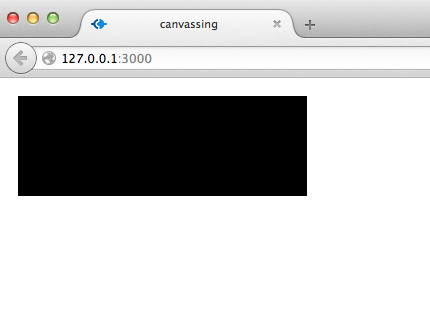

# Introduction

## Thank you!

Thanks for checking out _Canvassing_!

### You'll learn these topics:

 - Drawing paths, shapes, etc., and working with color
 - Drawing images/spritesheets on the canvas
 - How to create a game/animation loop
 - Detecting mouse & keyboard input
 - Creating complex animation sequences
 - Using the canvas tag in tandem with manipulating other html elements
 - Making animated gifs from a canvas animation
 - Using video on the canvas
 - An overview of awesome libraries you can use with the canvas tag
 - Usage of methods and properties of the canvas tag
 - Using JavaScript modules from npm for browser-side code
 - Introduce you to modern development tools & practices

## Tools used in this book

The set of tools used in this book is as small as possible. The focus is on use of the canvas. Following is a brief overview of the tools we'll use, and in the next chapter we'll go through installation instructions for each of the tools.

### Terminal

You'll be using the terminal in this book's tutorials. [The Terminal chapter in Development Environments for Beginners](https://github.com/sethvincent/dev-envs-book/blob/master/manuscript/terminal.md) will help you get started.

### Node.js, npm, & the browser

This book champions build tools like Browserify for using modules from npm in the browser. As a result, you'll need Node.js installed on your computer.

In each chapter we'll explore the canvas, npm, and the terminal. By the end of the book you'll have explored a set of tools for creative coding that will serve you no matter the type of JavaScript projects you choose.

### git

I encourage you to use git as version control software to track changes as you complete tutorials. If you're new to git, learn more about it in this [Git chapter of the Development Environments book](http://git-scm.com/book), the [Try Git interactive tutorial](http://try.github.io/), and the [Pro Git book that's available for free on the git website](http://git-scm.com/book).

### GitHub & GitHub Pages

I recommend that you put each project you make while reading this book up on GitHub, and if applicable, GitHub Pages. It'll be good practice if you're new to git and GitHub.

Learn more about GitHub pages in the [related chapter of the Development Environments book](https://github.com/sethvincent/dev-envs-book/blob/master/manuscript/github.md), and on [GitHub's Help section](https://help.github.com/categories/20/articles).

## More books

There's a good chance that if you like this book you'll be interested in the other books in the Learn.js series.

**Check them out!**

- [Introduction to JavaScript & Node.js](http://learnjs.io/books/learnjs-01)
- [Making 2d JavaScript Games](http://learnjs.io/books/learnjs-02)
- [Mapping with Leaflet.js](http://learnjs.io/books/learnjs-03)
- [Development Environments for Beginners](http://learnjs.io/books/dev-envs)
- [Theming with Ghost](http://themingwithghost.com)
- [npm recipes](http://learnjs.io/npm-recipes)

Learn more at [learnjs.io](http://learnjs.io).


# Getting set up

Sometimes the hardest part of learning a new set of tools is getting them installed. With that in mind, this chapter will get you set up with everything you need to get started. The toolset is kept as minimal as possible so that our focus is on the canvas, not on the development tools.


## Install Node.js

To install Node.js, go to [nodejs.org](http://nodejs.org) and download the installer for your operating system.

## Install git

For instructions on installing and getting started with git, see this chapter of the book Development Environments for Beginners: [https://github.com/sethvincent/dev-envs-book/blob/master/chapters/06-git.md](https://github.com/sethvincent/dev-envs-book/blob/master/chapters/06-git.md)

(It's free on GitHub)

## Create a GitHub account

If you haven't already, create an account on GitHub: [github.com](http://github.com)

I recommend practicing with git & GitHub by storing your work from the chapters in this book as a repository on GitHub. And if you do, definitely tweet or email a link to the repo to [twitter.com/learnj_io] or hi@learnjs.io!

## Choose a text editor

I recently switched to [Atom](https://atom.io/), the editor made by GitHub, but [Sublime](http://www.sublimetext.com/), [vim](http://vim-adventures.com/), and [Brackets](http://brackets.io) are all reasonable choices. Experiment with a few and choose the editor that feels right to you.

## Create a folder for the book's tutorials

Navigate to the location on your computer where you'd like to store the code you write while working through the tutorials in this book.

I like to put code like this in my `Documents` folder (I use a Mac).

So for example I would do this:

**Navigate to the `Documents` folder:**

```
cd ~/Documents
```

**Create a `canvassing` folder:**

```
mkdir canvassing
```

**Navigate into the `canvassing` folder:**

```
cd canvassing
```

Now you are ready to start!


# Drawing "hello" with lines

## Drawing lines

OK, so this chapter's title promises that we will draw the word "hello" using lines. Turns out that would be a lot of lines. Instead we're drawing the word "HI".

## The goal

The following screenshot shows the end goal for this chapter:


## Files & folders

Let's get set up for the tutorial in this chapter.

### Create a folder for this chapter's code:

```
mkdir hello-with-lines
cd hello-with-lines
```

### Create an index.html and game.js file:

```
touch index.html game.js
```

Add the following to the index.html file:

```
<!doctype html>
<html>

<head>
<title>canvassing</title>
</head>

<body>
  <canvas id="game"></canvas>

  <script src="game.js"></script>
</body>

</html>
```

Add the following two lines to the game.js file:

```
var canvas = document.getElementById('game');
var context = canvas.getContext('2d');
```

This line: 

```
var canvas = document.getElementById('game');
``` 

finds our canvas tag in the html file, and sets the `canvas` variable to reference that tag.

And the following line: 

```
var context = canvas.getContext('2d');
``` 

sets the `context` variable to reference the 2d drawing context of the canvas.

## About the `canvas` and `context` variables

### canvas

The `canvas` variable is a reference the `<canvas>` html element. It mostly has the same methods and properties as other html elements, so there's not much special going on there.

To be able to draw to the canvas, you need to choose a drawing context using the `.getContext()` method. When we call `canvas.getContext('2d')` we're choosing a 2d drawing context, and this provides us the API for doing the actual drawing.

### context

All the drawing occurs with the help of the `context` variable which references the 2d drawing context. It has many methods and properties that you can use. In this book we'll use only a handful, but the API reference in the appendix gives descriptions & examples.

## Set `canvas` width and height

Like other html elements, you can set the width and height of the canvas using JavaScript.

Below the `var context` line in the game.js file, add the following:

```
canvas.width = 800;
canvas.height = 400;
```

This will make the canvas 800px wide by 400px tall.

## Paths, moving, and lines

We'll be creating paths on the canvas using these four methods:

- `context.beginPath()`
- `context.moveTo()`
- `context.lineTo()`
- `context.stroke()`

### context.beginPath()

This method indicates that we are going to start drawing. It starts a new path. `context.beginPath()` should be called before you call methods like `context.moveTo()`.

### context.moveTo()

This method makes me think of taking a pen and moving it to a specific spot on a peice of paper. It takes two arguments, the x and y coordinates.

The following example would move to the top left corner of the canvas:

```
context.moveTo(0, 0);
```

### context.lineTo()

This method draws a line starting from the current position (determined in this case by the moveTo() method) to the x and y coordinates given as arguments.

This example draws a short line from the top left corner of the canvas:

```
context.moveTo(0, 0);
context.lineTo(15, 15);
```

### context.stroke()

This method indicates that the path we are drawing should have a stroke. A stroke is an outline or line on the path that we've set using `moveTo()` and `lineTo()`.

Here's a full example that draws from the top left corner of the canvas to the (50, 50) position on the canvas:

```
context.beginPath();
context.moveTo(0, 0);
context.lineTo(50, 50);
context.stroke();
```

## Drawing "HI"

Based on the information above, we can draw the word "HI" using the following code:

```
var canvas = document.getElementById('game');
var context = canvas.getContext('2d');

context.beginPath();

/* H */
context.moveTo(20, 20);
context.lineTo(20, 50);

context.moveTo(20, 35);
context.lineTo(35, 35);

context.moveTo(35, 20);
context.lineTo(35, 50);

/* I */
context.moveTo(50, 20);
context.lineTo(65, 20);

context.moveTo(57, 20);
context.lineTo(57, 50);

context.moveTo(50, 50);
context.lineTo(65, 50);

context.stroke();
```

That's a lot of code for two little letters!

Remember that `serve` command we installed in the **Getting set up** chapter? We're going to use it now.

Run `serve` in the terminal.

This well serve your project at this url on your computer: `http://localhost:3000`

Navigate to that url in your browser and you should see this:


Play with the values to get a sense of how the coordinates work.

### Want to change the color?

Cool, let's do that.

Before the `context.stroke()` line, add the following:

```
context.strokeStyle = '#ff0000';
```

You can use hex or rgb color codes using the `context.strokeStyle` property.

### Can we change the width of the lines?

Yes. Here's how:

Add the following just after the `context.strokeStyle` line:

```
context.lineWidth = 10;
```

That "HI" looks a little weird now:


Weird but cool.

## A challenge for you

Make other words! Or experiment with drawing whatever you want using the `context.lineTo()` method.

One last thing: try out the `context.lineCap` property. You can set it to `butt`, `round`, or `square`. This will give your lines different end caps depending on the option you choose. Here's an example that gives your lines rounded end caps:

```
context.lineCap = 'round';
```

## Summary

This was a basic introduction to using the `canvas` and `context` variables. We covered the usage of these methods:

- `context.beginPath()` - for starting a path
- `context.moveTo()` - for setting the starting position of the path
- `context.lineTo()` - for drawing the path
- `context.stroke()` - for setting a stroke along the path

## Next chapter: easier text code

In the next chapter we'll write more text to the canvas, but it'll be easier than drawing a bunch of lines!


# Writing on a canvas with text

Alright, this time let's actually write the word "hello" to the canvas, rather than the shortcut we took last time.

It'll be easier this time, because we can use the `context.fillText()` method to draw arbitrary text without having to draw the actual lines of the characters. We can also choose the font family, size, and other attributes of the text.

## The goal

## Files & folders

To get started, let's copy the folder from last chapter like this:

```
cp -R hello-with-lines writing-text
```

Make sure you're up one level from the chapter folders. If you're inside a chapter folder, you can run `cd ..` to navigate up one level.

After copying the folder, change directory into it:

```
cd writing-text
```

## Revise the game.js file

Delete most of the code from the game.js file so that you are left with only these two lines:

```
var canvas = document.getElementById('game');
var context = canvas.getContext('2d');
```

## Write the word "hello"

Add this line to the game.js file to write the word "hello":

```
context.fillText('hello', 100, 100);
```

This will place the word hello in small text at the (100, 100) position of the canvas.

Run the `serve` command in your terminal and go to `http://localhost:3000` in your browser.

You should see this:


## Changing font size

We can set the font of the text using the `context.font` property. It accepts values similar to the CSS `context.font` property.

Here's an example:

```
context.font = "50px sans-serif";
```

The default value for the `context.font` property is `'10px sans-serif'` so the above code should change things significantly. Add that example code above the `context.fillText()` line so that game.js looks like this:

```
var canvas = document.getElementById('game');
var context = canvas.getContext('2d');

context.font = "50px sans-serif";
context.fillText('hello', 100, 100);
```

If you refresh the browser, it should now look like this:


## Changing font style and color

We can change the font color similar to how we set the color of the lines in the last chapter, by using the `context.fillStyle` property.

We can make the font italic and use a different font by setting `context.font` to different values. Revise the `context.font` line in your game.js file to look like this:

```
context.font = "italic 30px Georgia, serif";
```

Make a new line for `context.fillStyle`:

```
context.fillStyle = "#ee8833"
```

The full code of the game.js file should now look like this:

```
var canvas = document.getElementById('game');
var context = canvas.getContext('2d');

context.font = "italic 30px Georgia, serif";
context.fillStyle = "#ee8833"
context.fillText('hello', 100, 100);
```

Refresh your browser and take a look at the changes:


## A challenge for you

Try out the `context.strokeText()` method. Note that you'll need to use the `context.strokeStyle` property to change the color instead of `context.fillStyle`.


## Summary

In this chapter we explored using the `context.fillText()` method and the `context.font` and `context.fillStyle` properties.

## Next chapter: animation

In the next chapter we'll focus on animating objects on the canvas.


# Creating an animation loop

It's great that we can draw lines and text on a canvas, but how do we animate things? How do we bring life to our work by making it move?

This chapter will focus on animating the canvas through the use of the `requestAnimationFrame()` function. We'll also introduce a new method: `context.fillRect()` for drawing rectangles.

In addition, we'll use the `Math.random()` method to give color to the rectangles and to move them around the screen in a semi-random way.

## The goal

By the end of this chapter we'll have a canvas animation where a bunch of rectangles will move around the screen changing color.

We'll end up with something like this:


## Files & folders

To get started, let's copy the folder from last chapter like this:

```
cp -R writing-text animation-loop
```

Make sure you're up one level from the chapter folders. If you're inside a chapter folder, you can run `cd ..` to navigate up one level.

After copying the folder, change directory into it:

```
cd writing-text
```

## Revise the game.js file

Delete most of the code from the game.js file so that you are left with only these two lines:

```
var canvas = document.getElementById('game');
var context = canvas.getContext('2d');
```

## The loop function

We'll need a function that will run with each frame of the animation. Let's name it `loop`. Create the function so that it looks like this:

```
function loop () {
  console.log('looping');
  requestAnimationFrame(loop);
}
```

After that function definition, call the `loop()` function:

```
loop();
```

The full code of the game.js file should now look like this:

```
var canvas = document.getElementById('game');
var context = canvas.getContext('2d');

function loop () {
  console.log('looping');
  window.requestAnimationFrame(loop);
}

loop();
```

`window.requestAnimationFrame()` will call the `loop` function on every frame. Browsers aim to run the animation at 60 frames per second.

Run the `serve` command in your terminal, then go to `http://localhost:3000`.

You'll see a blank screen, so open the JavaScript console. With Chrome you can do this by navigating through the application menu View > Developer > JavaScript Console. With Firefox go to Tools > Web Developer > Web Console.

You should see `looping` in the console along with a number uppdating with how many times the loop has run.

All of our code that needs to be run on each frame will be executed inside the `loop()` function, just like the `console.log()` example above.

## The draw function

To do the drawing of our animation, we need a `draw()` function. This will contain all of our drawing-specific code.

Above the `loop` function declaration, add this:

```
function draw () {
  context.fillRect(10, 10, 100, 100);
}
```

The `context.fillRect()` method arguments are, in order: 

- x position **10**
- y position **10**
- width **100**
- height **100**

This will braw a 100x100 pixel rectangle with its top-left corner at the (10, 10) coordinates of the canvas.

Call `draw()` inside the `loop` declaration:

```
function loop () {
  draw();
  window.requestAnimationFrame(loop);
}
```

This way it will be called on each frame.

Go to the browser, refresh, and you should see this:


## The update function

To make our rectangle move, to handle the logic of our animation, we'll need an `update()` function.

Declare it above the `draw` function declaration:

```
function update () {
  
}
```

In order to change where the rectangle is being drawn, we need to create a variable to hold that information. In this case we'll create an object named `box`.

`box` will have these properties:

- x position
- y position
- width 
- height

Here's how to define the box object:

```
var box = {
  x: 10,
  y: 10,
  width: 100,
  height: 100
};
```

Now, in the `update` function let's increment the x position by `1` on each loop:

```
function update () {
  box.x += 1;
}
```

The `+=` operator is shorthand. The long form of that expression would look like this: `box.x = box.x + 1`.

Now add the `update()` function call to the declaration of the `loop` function:

```
function loop () {
  update();
  draw();
  window.requestAnimationFrame(loop);
}
```

In the `draw` function replace the literal values with the properties of `box`:

```
function draw () {
  context.fillRect(box.x, box.y, box.width, box.height);
}
```

The full code of the game.js file should now look like this:

```
var canvas = document.getElementById('game');
var context = canvas.getContext('2d');

var box = {
  x: 10,
  y: 10,
  width: 100,
  height: 100
};

function draw () {
  context.fillRect(box.x, box.y, box.width, box.height);
}

function update () {
  box.x += 1;
}

function loop () {
  update();
  draw();
  window.requestAnimationFrame(loop);
}

loop();
```

Refresh the browser and it will look as though that 100x100 square is turning into a wider rectangle:



_wat._

## Make the square move, not elongate

The problem is that on every loop the canvas is being drawn on, but we need to clear the last frame's drawing.

To do this we will use the `context.clearRect()` method. Add it to the top of the `draw` function declaration. It takes the same x, y, width, height properties as the `context.fillRect()` method.

```
function draw () {
  context.clearRect(0, 0, canvas.width, canvas.height);
  context.fillRect(box.x, box.y, box.width, box.height);
}
```

We're clearing the canvas from the (0, 0) coordinates to the end of the canvas's width and height.

Refresh the browser and you'll now see the box slowly moving to the right side of the screen.

## Making multiple boxes

One box is nice, but let's make 100 boxes!

For this we'll need a constructor function. We're going to delete the `box` object, and replace it with this:

```
function Box () {
  this.x = 10;
  this.y = 10;
  this.width = 100;
  this.height = 100;
}
```

Note that as a convention the name `Box` is capitalized to indicate that it is a constructor function used to create objects.

Now, to make a new box, we can do this:

```
var box = new Box();
```

That will create a `box` object just like the one we originally made.

But how do we make multiple boxes?

Below the `Box` declaration, add the following:

```
var boxes = [];
var totalBoxes = 100;

for (var i=0; i<totalBoxes; i++) {
  boxes[i] = new Box();
}
```

That gives us an array of `Box` objects! Cool, but how do we draw them?

Rewrite the `draw` function declaration to look like this:

```
function draw () {
  context.clearRect(0, 0, canvas.width, canvas.height);
  
  boxes.forEach(function(box, i) {
    context.fillRect(box.x, box.y, box.width, box.height);
  });
}
```

We also need to rewrite the `update` function in a similar way:

```
function update () {
  boxes.forEach(function(box, i) {
    box.x +=1;
  });
}
```

**Now we have a problem.**

You may be refreshing the browser now, like I have done before, and are noticing that nothing seems to have changed. 

Is it still just one box?

Sorta? It's 100 boxes all drawing in the same exact spot on each frame.

For this exercise, we'll fix the problem with randomness.

## Using Math.random

Let's revise the `update` function to determine movement of the box using `Math.random()`:

```
function update () {
  boxes.forEach(function(box, i) {
    box.x += Math.random() < 0.5 ? -1 : 1;
    box.y += Math.random() < 0.5 ? -1 : 1;
  });
}
```

After making the above revision, refresh the browser and take a look:


Those boxes just move around all weird on that canvas.

Let's create a `randomNumbers()` function so that we don't have to call `Math.random()` twice in a row like we are in the `update` function.

Add it to the bottom of the file:

```
function randomNumber(min, max) {
  return Math.round(Math.random() * (max - min + 1) + min);
}
```

The above function allows us to call `randomNumber()` with a minimum and maximum number so that we can use it in multiple places.

Revise the `update` function again to use our new function, this time setting the minimum at `-5` and the maximum at `5`:

```
function update () {
  boxes.forEach(function(box, i) {
    box.x += randomNumber(-5, 5);
    box.y += randomNumber(-5, 5);
  });
}
```

Refresh the browser and you'll see the boxes moving a lot faster!

It's still hard to tell what's going on, so let's change the color of those boxes. Let's create a `randomColor()` function that also makes use of our `randomNumber` function: 

```
function randomColor(rmin, rmax, gmin, gmax, bmin, bmax, alpha){
  var r = randomNumber(rmin, rmax);
  var g = randomNumber(gmin, gmax);
  var b = randomNumber(bmin, bmax);
  return 'rgba(' + r + ', ' + g + ', ' + b + ', ' + alpha + ')';
}
```

That's a lot of arguments! In order they are:

- minimum for red value
- maximum for red value
- minimum for green value
- maximum for green value
- minimum for blue value
- minimum for blue value
- alpha value for setting transparency

Let's use it for setting the color of the boxes!

Revise the `for` loop at the top of the file to set a color property on all of the boxes:

for (var i=0; i<totalBoxes; i++) {
  boxes[i] = new Box();
  boxes[i].color = randomColor(0, 255, 0, 255, 0, 255, .5);
}

Now use the color property to set the `context.fillStyle` property in the `draw` function:

```
function draw () {
  context.clearRect(0, 0, canvas.width, canvas.height);
  
  boxes.forEach(function(box, i) {
    context.fillStyle = box.color;
    context.fillRect(box.x, box.y, box.width, box.height);
  });
}
```

The full code of the game.js file should now look something like this:

```
var canvas = document.getElementById('game');
var context = canvas.getContext('2d');

function Box () {
  this.x = 10;
  this.y = 10;
  this.width = 100;
  this.height = 100;
}

var boxes = [];
var totalBoxes = 100;

for (var i=0; i<totalBoxes; i++) {
  boxes[i] = new Box();
  boxes[i].color = randomColor(0, 255, 0, 255, 0, 255, .5);
}

function draw () {
  context.clearRect(0, 0, canvas.width, canvas.height);
  
  boxes.forEach(function(box, i) {
    context.fillStyle = box.color;
    context.fillRect(box.x, box.y, box.width, box.height);
  });
}

function update () {
  boxes.forEach(function(box, i) {
    box.x += randomNumber(-5, 5);
    box.y += randomNumber(-5, 5);
  });
}

function randomNumber(min, max) {
  return Math.round(Math.random() * (max - min + 1) + min);
}

function randomColor(rmin, rmax, gmin, gmax, bmin, bmax, alpha){
  var r = randomNumber(rmin, rmax);
  var g = randomNumber(gmin, gmax);
  var b = randomNumber(bmin, bmax);
  return 'rgba(' + r + ', ' + g + ', ' + b + ', ' + alpha + ')';
}

function loop () {
  update();
  draw();
  window.requestAnimationFrame(loop);
}

loop();
```

Refresh that browser, friend. Things are getting interesting:


**One last thing.** Let's set the canvas width and height to a larger size so we can see the boxes move around some more:

```
canvas.width = 1024;
canvas.height = 400;
```


## A challenge for you

Experiment with this code. Make it weird. Specifically, try changing the width and height of the boxes when they're created and also on each call of the update function.

One thing you should try is setting the properties of the box objects when calling `new Box()`.

Revise the `Box` constructor to look like this:

```
function Box (options) {
  this.x = options.x || 10;
  this.y = options.y || 10;
  this.width = options.width || 100;
  this.height = options.height || 100;
  this.color = '#000000'
}
```

This will allow you to provide alternate values for the properties like this:

```
var box = new Box({
  x: 20,
  y: 100,
  width: 25,
  height: 50,
  color: 'red'
});
```


## Summary

This chapter was a whirlwind of fun topics:

- `requestAnimationFrame()` for animating at a consistent framerate.
- Creating `loop`, 'draw', and 'update' functions.
- Using `context.fillRect()` and `context.clearRect()`.
- Using a `for` loop and a `.forEach()` method.
- Creating the `box` object.
- Refactoring to use a constructor function and an array of objects
- Working with `Math.random()`.

Welp. That was a big chapter! All in preparation for the next one.

## Next chapter: the mouse

In the next chapter we'll be focused on one thing: the mouse. We'll figure out how to draw things at the position of the mouse pointer as well as listen for the `click` event to do cool things on the canvas.


# Drawing on a canvas with a mouse

After making things move around on the screen in the last chapter, it's time to learn about user interaction. And in this chapter we'll focus on interacting with the canvas using the mouse.

## The goal

We're going to refactor last chapter's code so that we can use the mouse to paint `Box` objects on the canvas.

By the end of this chapter we'll end up with something like this:


## Files & folders

To get started, let's copy the folder from last chapter like this:

```
cp -R animation-loop mouse
```

Make sure you're up one level from the chapter folders. If you're inside a chapter folder, you can run `cd ..` to navigate up one level.

After copying the folder, change directory into it:

```
cd mouse
```

## Revise the game.js file

We'll actually keep the game.js almost exactly the same as it was at the end of the animation loop chapter. We'll be adding code that handles mouse events so that we can draw Box objects to the canvas.

To clean things up we'll delete the code related the the `boxes` array from the  `update` function declaration:

```
function update () {

}
```

Also: delte the `totalBoxes` variable and the for loop that automatically generates 100 Box objects.

Because we'll be doing some drawing in this chapter, let's make the canvas fill the full width and height of the browser.

Add the following to the index.html file:

```
<style>
body { margin:0px; padding:0px; }
</style>
```

Put it just after the `<title>` tag in the `<head>` tag. The full code of the index.html file should now look like this:

```
<!doctype html>
<html>

<head>
<title>canvassing</title>
<style>
body { margin:0px; padding:0px; }
</style>
</head>

<body>
  <canvas id="game"></canvas>
  
  <script src="game.js"></script>
</body>

</html>
```

Now we'll change the values of the `canvas.width` and `canvas.height` properties in the game.js file:

```
canvas.width = window.innerWidth;
canvas.height = window.innerHeight;
```

The two `window` properties we're using above return the width and height of the window.

The full game.js file should now look like this:

```
var canvas = document.getElementById('game');
var context = canvas.getContext('2d');

canvas.width = window.innerWidth;
canvas.height = window.innerHeight;

function Box (options) {
  this.x = options.x || 10;
  this.y = options.y || 10;
  this.width = options.width || 100;
  this.height = options.height || 100;
  this.color = options.color || '#000000'
}

var boxes = [];

function draw () {
  context.clearRect(0, 0, canvas.width, canvas.height);
  
  boxes.forEach(function(box, i) {
    context.fillStyle = box.color;
    context.fillRect(box.x, box.y, box.width, box.height);
  });
}

function update () {

}

function randomNumber(min, max) {
  return Math.round(Math.random() * (max - min + 1) + min);
}

function randomColor(rmin, rmax, gmin, gmax, bmin, bmax, alpha){
  var r = randomNumber(rmin, rmax);
  var g = randomNumber(gmin, gmax);
  var b = randomNumber(bmin, bmax);
  return 'rgba(' + r + ', ' + g + ', ' + b + ', ' + alpha + ')';
}

function loop () {
  update();
  draw();
  window.requestAnimationFrame(loop);
}

loop();
```

## Listening for mouse events

There are a bunch of mouse events that you can use in your JavaScript code.

### List of mouse events:

**mousedown**

When you press the left mouse button down.

**mouseup**

When you release the left mouse button.

**click**

When you click with the left mouse button, happens after mousedown and mouseup.

**dblclick**

Double-clicking with the left mouse button. Rarely used.

**mousemove**

When you move the mouse this event provides the mouse coordinates.

**mouseover**

When you make the mouse enter the area of an html element, this event fires.

**mouseout**

This event fires when you make the mouse exit the area of an html element.

**contextmenu**

This event fires when you right-click or control-click on an element.


When defining an event, we use the `document.addEventListener` method.

Here's an example:

```
document.addEventListener(function (e) {
  console.log(e);
});
```

The `document.addEventListener` method takes a callback function as an argument, which in turn provides an event object. In the above example the object is named `e`, though you could change it to something like `event` if you want.

In this chapter we'll focus on the mousemove, mousedown, and mouseup events. We'll use those events to control when we draw boxes on the canvas.


## Track when the drawing happens

We'll need a boolean variable that we can toggle between `true` and `false` when we start and stop drawing.

Let's name this variable `drawing` and place it just after the `var boxes = [];` line:

```
var boxes = [];
var drawing = false;
```

Next let's create event listeners for mousedown and mouseup:

```
document.addEventListener('mousedown', function (e) {

});

document.addEventListener('mouseup', function (e) {

});
```

Place the above code just after the `var drawing = false;` line.

In the mousedown event set `drawing` to `true`:

```
document.addEventListener('mousedown', function (e) {
  drawing = true;
});
```

In the mouseup event set `drawing` to `false`:

```
document.addEventListener('mouseup', function (e) {
  drawing = false;
});
```

Now, if our boxes are going to be drawn in different locations of the canvas based on where the mouse is, we'll need to know the mouse's location at all times.

For that, we'll use the mousemove event. Create the listener:

```
document.addEventListener('mousemove', function (e) {
  console.log(drawing, e)
});
```

You'll see in the above example I'm using console.log to print the `drawing` variable and the `e` object to the console.

In the terminal run the `serve` command. Next go to the browser and load http://localhost:3000. We aren't drawing anything to the screen yet, but we should be able to see the console.log calls in the console.

Click and drag around the canvas and you should see something like this:


## Actually draw boxes

Let's rewrite the `mousemove` event listener now to actually draw boxes when drawing happens. 

Let's create a `boxSize` variable set to `10`. We'll use it as the size for the width and height of new `Box` objects.

Create the `boxSize` variable just after the `var drawing = false;` line:

```
var boxSize = 10;
```

Next we'll need to check if `drawing === true`, then create new `Box` objects and put them in the `boxes` array.

Here's the rewritten `mousemove` listener:

```
document.addEventListener('mousemove', function (e) {
  if (drawing === true) {
    boxes[boxes.length] = new Box({
      x: e.clientX - boxSize/2,
      y: e.clientY - boxSize/2,
      width: boxSize,
      height: boxSize,
      color: randomColor(100, 255, 0, 0, 0, 255, 0.5)
    });
  }
});
```

**Let's take a look at that code in chunks:**

An if statement that makes sure our drawing code is only executed when the `drawing` variable is true:

```
  if (drawing === true) {
```

Creating a new `Box` object on each mouse movement:

```
    boxes[boxes.length] = new Box(
```

Note that above we're using `boxes.length` to specificy the position in the `boxes` array that the new `Box` object will be stored in. Because the `boxes` array starts out empty, the first object will be at `boxes[0]`, the next at `boxes[1]`, and so on.

The options for the `Box` constructor:

```  
    {
      x: e.clientX - boxSize/2,
      y: e.clientY - boxSize/2,
      width: boxSize,
      height: boxSize,
      color: randomColor(100, 255, 0, 0, 0, 255, 0.5)
    }
```

We're setting the (x, y) coordinates of each box to be the mouse's (x, y) position minus half the size of the box. This makes it so that when a box is drawn, its center is at the tip of the mouse.

The width and height are set to the `boxSize` variable. The color is set to the output of the `randomColor()` function, and you'll see that I played with the arguments to make the boxes a reddish-purple color.

**The full code for this chapter should now look like this:**

```
var canvas = document.getElementById('game');
var context = canvas.getContext('2d');

canvas.width = window.innerWidth;
canvas.height = window.innerHeight;

function Box (options) {
  this.x = options.x || 10;
  this.y = options.y || 10;
  this.width = options.width || 100;
  this.height = options.height || 100;
  this.color = options.color || '#000000'
}

var boxes = [];
var drawing = false;
var boxSize = 10;

document.addEventListener('mousedown', function (e) {
  drawing = true;
});

document.addEventListener('mouseup', function (e) {
  drawing = false;
});

document.addEventListener('mousemove', function (e) {
  if (drawing === true) {
    boxes[boxes.length] = new Box({
      x: e.clientX - boxSize/2,
      y: e.clientY - boxSize/2,
      width: boxSize,
      height: boxSize,
      color: randomColor(100, 255, 0, 0, 0, 255, 0.5)
    });
  }
});

function draw () {
  context.clearRect(0, 0, canvas.width, canvas.height);

  boxes.forEach(function(box, i) {
    context.fillStyle = box.color;
    context.fillRect(box.x, box.y, box.width, box.height);
  });
}

function update () {
  
}

function randomNumber(min, max) {
  return Math.round(Math.random() * (max - min + 1) + min);
}

function randomColor(rmin, rmax, gmin, gmax, bmin, bmax, alpha){
  var r = randomNumber(rmin, rmax);
  var g = randomNumber(gmin, gmax);
  var b = randomNumber(bmin, bmax);
  return 'rgba(' + r + ', ' + g + ', ' + b + ', ' + alpha + ')';
}

function loop () {
  update();
  draw();
  window.requestAnimationFrame(loop);
}

loop();
```

Run the `serve` command in your terminal, then go to `http://localhost:3000`.

Click and drag on the canvas for a bit, and you should see something like this:


 
## A challenge for you

Take this example further by letting boxes move around after you place them!

You'll need to create the logic for the box movement in the `update()` function that is currently empty. Refer to the code in the `update()` function from last chapter for ideas.

## Summary

In this chapter we've explored:

- Listening for mouse events in the browser, with a focus on:
  - mousedown
  - mouseup
  - mousemove
- Working with arrays and constructor functions

## Next chapter: the keyboard

We'll continue with learning about browser events in the next chapter with a focus on keyboard events. You know how you can control game characters with the arrow keys? Or make them jump with the space bar? We'll be exploring those types of keyboard interactions.


# Keyboard input

Games are fun. Most games require some kind of keyboard interaction. In this chapter we'll use the keyboard to control a `Box` object and move it around the screen. We'll also use the space bar so that when it is pressed we'll spawn more `Box` objects like bullets.

Additionally we'll start experimenting with collision by detecting when our player hits the sides of the canvas.

## The goal

We have two primary goals for this chapter:
- Moving a `Box` object around with the arrow keys.
- Making our 'Box' object shoot other smaller 'Box' objects as bullets when we press the space bar.

We'll end up with something like this:


## Files & folders

To get started, let's copy the folder from last chapter like this:

```
cp -R mouse keyboard
```

Make sure you're up one level from the chapter folders. If you're inside a chapter folder, you can run `cd ..` to navigate up one level.

After copying the folder, change directory into it:

```
cd keyboard
```

## Revise the game.js file

Replace the contents of the game.js file with the following code:

```
var canvas = document.getElementById('game');
var context = canvas.getContext('2d');

canvas.width = window.innerWidth;
canvas.height = window.innerHeight;

function Box (options) {
  this.x = options.x || 10;
  this.y = options.y || 10;
  this.width = options.width || 100;
  this.height = options.height || 100;
  this.color = options.color || '#000000'
}

function update () {
  
}

function draw () {
  context.clearRect(0, 0, canvas.width, canvas.height);
}

function loop () {
  update();
  draw();
  window.requestAnimationFrame(loop);
}

loop();
```

## Detecting input

We'll be watching for keyboard events in this chapter, which is very similar to the way we watched for mouse events in the previous chapter.

Here's a list of keyboard events:

**keydown**

Fires when a key is pushed down.

**keyup**

Fires when a key is released.

**keypress**

The keypress is a little different: it fires when a key is released, and also typically fires repeatedly when held down. I tend to use a combination of keydown and keyup instead of keypress.

In this chapter's example we'll perform actions on keydown and on keyup.

We need to track which keys are being pressed, so let's use an object to store only those keys:

```
var keys = {};
```

Next, we need event listeners for keydown and keyup:

```
window.addEventListener('keydown', function (e) {
  keys[e.keyCode] = true;
  e.preventDefault();
});

window.addEventListener('keyup', function (e) {
  delete keys[e.keyCode];
});
```

In the keydown event we add the keyCode of the key being pushed down to the `keys` object as a property and set it's value to true.

In the keyup event we delete the keyCode from the object entirely using the `delete` operator.

Note that the keydown event includes the line `e.preventDefault()`. This makes it so that the usual actions associated with the keys are not triggered. For instance: if we want to use the space bar to trigger something on the canvas we don't want it to also trigger the default "next page" functionality that's built in to browsers. Some with others, like the arrow keys.


## Create the player and bullets

Here we'll use the `Box` constructor to create a player, much like we did in previous examples:

```
var player = new Box({
  x: 10,
  y: 10,
  width: 50,
  height: 50,
  color: '#f4ed12',
  speed: 5
});
```

We also need an array for storing the bullets that the player shoots:

```
var bullets = [];
```

Now that we've got a player object and we are able to track the keys that are being pressed, we need to associate the keys with actions that the player performs.

We're interested in the space key, which has a keyCode of 32, and the arrow keys, which are 37 (left), 38 (up), 39 (right), and 40 (down).

Create an input function that takes the player as an argument, and use if statements to change the player's direction based on the arrow keys being pressed.

Additionally, each time the space button is pressed, create a new bullet using the `Box` constructor and add it to the `bullets` array.

Here's how the `input()` function should look:

```
function input (player) {
  if (37 in keys) {
    player.x -= player.speed;
  }
  if (39 in keys) {
    player.x += player.speed;
  }
  if (38 in keys) {
    player.y -= player.speed;
  }
  if (40 in keys) {
    player.y += player.speed;
  }
  
  if (32 in keys) {    
    bullets[bullets.length] = new Box({
      x: player.x + player.width / 2,
      y: player.y + player.height / 2,
      width: 4,
      height: 4,
      color: '#e3dc01',
      speed: 10
    });
  }
}
```

The `bullets[bullets.length]` trick is used to add new items to the array, starting at zero and incrementing by one each time a new item is added.


## Detecting boundaries

Let's restrict the player so that they can't go outside of the canvas area. To do that, we'll create a `boundaries()` function that takes a box object as the argument, and use if statements to figure out the position of the box on the canvas. Remember that the coordinates of the canvas start with the top left corner at (0, 0). That means to move right, we need to increase the player.x number, to move up we need to decrease the player.y number, and so on.

The `boundaries()` function should look something like this:

```
function boundaries (box) {
  if (box.x <= 0) {
    box.x = 0;
  }
  if (box.x + box.width >= canvas.width) {
    box.x = canvas.width - box.width;
  }
  if (box.y <= 0) {
    box.y = 0;
  }
  if (box.y + box.height >= canvas.height) {
    box.y = canvas.height - box.height;
  }
}
```

You'll notice that at the right and bottom edges we have to include the height and width of the box in our calculations. That's because like the canvas itself, rectangle coordinates start at the top left corner.

## Drawing rectangles

Let's create a function that can draw any of our boxes, whether it's the player or a bullet, to the screen. Create a function named `drawBox()` that takes a box object as an argument, sets `context.fillStyle` to the box's color, and calls the 'context.fillRect()' method with the boxes (x, y) coordinates, width and height.

The `drawBox()` function definition should look like this:

```
function drawBox (box) {
  context.fillStyle = box.color;
  context.fillRect(box.x, box.y, box.width, box.height);
}
```

## Revise the update and draw functions

Revise the `update()` function to include the `input()` and `boundaries()` functions:

```
function update () {
  input(player);
  boundaries(player);
}
```

In the `draw()` function, use `drawBox()` with both the player and each of the bullets:

```
function draw () {
  context.clearRect(0, 0, canvas.width, canvas.height);
  drawBox(player);
  bullets.forEach(function (b) {
    drawBox(b);
  });
}
```

### Check out the progress so far

In the terminal run the `serve` command. Next go to the browser, load http://localhost:3000 and you should be able to move the rectangle with the arrow keys!

However, if you press the space bar, you'll an issue:


The bullets just get stuck in one place without moving around. That will not do.

## Bullets that move around

For this example we'll make bullets move in the direction that the player was last moving in. We can track that as a property on the player object.

Let's make the following revisions to the input() function:

```
function input (player) {
  if (37 in keys) {
    player.x -= player.speed;
    player.direction = 'left';
  }
  if (39 in keys) {
    player.x += player.speed;
    player.direction = 'right';
  }
  if (38 in keys) {
    player.y -= player.speed;
    player.direction = 'up';
  }
  if (40 in keys) {
    player.y += player.speed;
    player.direction = 'down';
  }
  
  if (32 in keys) {    
    bullets[bullets.length] = new Box({
      x: player.x + player.width / 2,
      y: player.y + player.height / 2,
      width: 4,
      height: 4,
      color: '#e3dc01',
      speed: 10,
      direction: player.direction
    });
  }
}
```

We also have to include the `direction` property in the `Box` constructor:

```
function Box (options) {
  this.x = options.x || 10;
  this.y = options.y || 10;
  this.width = options.width || 100;
  this.height = options.height || 100;
  this.color = options.color || '#000000';
  this.speed = options.speed || 5;
  this.direction = options.direction || 'right';
}
```

And to make the bullets move, we need to update their positions in our `update()` function:

```
function update () {
  input(player);
  boundaries(player);
  bullets.forEach(function (b) {
    if (b.direction == 'left') {
      b.x -= b.speed;
    }
    if (b.direction == 'right') {
      b.x += b.speed;
    }
    if (b.direction == 'up') {
      b.y -= b.speed;
    }
    if (b.direction == 'down') {
      b.y += b.speed;
    }
  });
}
```

We should now be able to shoot in the direction that the player is moving. Reload the browser and you'll be able to do something like this:


The full code should be ~120 lines of awesome like the following:

```
var canvas = document.getElementById('game');
var context = canvas.getContext('2d');

canvas.width = window.innerWidth;
canvas.height = window.innerHeight;

var keys = {};

window.addEventListener('keydown', function (e) {
  keys[e.keyCode] = true;
  e.preventDefault();
});

window.addEventListener('keyup', function (e) {
  delete keys[e.keyCode];
});

function Box (options) {
  this.x = options.x || 10;
  this.y = options.y || 10;
  this.width = options.width || 100;
  this.height = options.height || 100;
  this.color = options.color || '#000000';
  this.speed = options.speed || 5;
  this.direction = options.direction || 'right';
}

var player = new Box({
  x: 10,
  y: 10,
  width: 50,
  height: 50,
  color: '#f4ed12',
  speed: 5
});

var bullets = [];

function input (player) {
  if (37 in keys) {
    player.x -= player.speed;
    player.direction = 'left';
  }
  if (39 in keys) {
    player.x += player.speed;
    player.direction = 'right';
  }
  if (38 in keys) {
    player.y -= player.speed;
    player.direction = 'up';
  }
  if (40 in keys) {
    player.y += player.speed;
    player.direction = 'down';
  }
  
  if (32 in keys) {    
    bullets[bullets.length] = new Box({
      x: player.x + player.width / 2,
      y: player.y + player.height / 2,
      width: 4,
      height: 4,
      color: '#e3dc01',
      speed: 10,
      direction: player.direction
    });
  }
}

function boundaries (box) {
  if (box.x <= 0) {
    box.x = 0;
  }
  if (box.x + box.width >= canvas.width) {
    box.x = canvas.width - box.width;
  }
  if (box.y <= 0) {
    box.y = 0;
  }
  if (box.y + box.height >= canvas.height) {
    box.y = canvas.height - box.height;
  }
}

function drawBox (box) {
  context.fillStyle = box.color;
  context.fillRect(box.x, box.y, box.width, box.height);
}

function update () {
  input(player);
  boundaries(player);
  bullets.forEach(function (b) {
    if (b.direction == 'left') {
      b.x -= b.speed;
    }
    if (b.direction == 'right') {
      b.x += b.speed;
    }
    if (b.direction == 'up') {
      b.y -= b.speed;
    }
    if (b.direction == 'down') {
      b.y += b.speed;
    }
  });
}

function draw () {
  context.clearRect(0, 0, canvas.width, canvas.height);
  drawBox(player);
  bullets.forEach(function (b) {
    drawBox(b);
  });
}

function loop () {
  update();
  draw();
  window.requestAnimationFrame(loop);
}

loop();
```

## A challenge for you

Actually, here are three challenges:

Refactor the `boundaries()` function so that bullets bounce off the sides of the canvas.

Create another type of `Box` that the player can shoot bullets at. Use the `boundaries()` function as inspiration for figuring out how to detect collision between bullets and these other boxes.

Experiment with how the direction of the bullets is determined. Consider involving the mouse, by creating bullets on the click event and making bullets move in that direction.

## Summary

In this chapter we used the keydown and keyup events to control a rectangle on the canvas. We also introduced usage of the `delete` operator, and created a number of functions to implement the project.

## Next chapter: drawing images

Next up: learning how to load images onto a canvas. We'll refactor the code from this chapter so that the player object draws an image to the canvas rather than a simple rectangle.


# Drawing images on a canvas

Drawing rectangles on the canvas is a fine method of creating the characters and other shapes in your animations and games. But if the shapes get really complex, it can be both hard to maintain and run slower than using images.

So let's learn how to load and draw images to the canvas.

## The goal

We'll end up with something like this:


A happy face spewing pink bullets all over.

## Files & folders

To get started, let's copy the folder from last chapter like this:

```
cp -R keyboard images
```

Make sure you're up one level from the chapter folders. If you're inside a chapter folder, you can run `cd ..` to navigate up one level.

After copying the folder, change directory into it:

```
cd images
```

## Revise the game.js file

We'll keep the same code from the keyboard chapter and refactor it so that we load and draw an image for the player instead of drawing a simple rectangle.

## Create a loadImage function

Above the `drawBox()` function definition, add the definition for a function named `loadImage()`:

```
function loadImage (path, callback) {
  var img = new Image();
  img.onerror = function(){
    callback('image failed to load');
  }
  img.onabort = function(){
    callback('image failed to load');
  }
  img.onload = function(){
    callback(null, img);
  }
  img.src = path;
}
```

This function takes two arguments: `path`, and `callback`.

The `path` argument is a relative file path to the image file.

The `callback` argument is the function that we'll call when the image is done loading.

Usage of the function will look something like this:

```
loadImage('some-image.png', function (error, image) {
  if (error) return console.error(error);
  
  // else do something with the image
});
```

Note that the callback function itself has an `error` argument that is `null` if there is no error, and an `image` argument that references the actual loaded image.

## Download an image to use

Here's an image we can use for this example:


Download it from this url:

```
https://cldup.com/yRCNYinTns-2000x2000.png
```

And put it in the images folder next to the index.html and game.js files.

Change the name of the image to face.png:

```
mv yRCNYinTns-2000x2000.png face.png
```

Next, let's actually call the `loadImage()` function.

It's important that the game loop doesn't start until the image is loaded.

Where the `loop()` function is called at the bottom of the file, revise it to look like this:

```
loadImage('face.png', function (error, image) {
  if (error) return console.error(error);
  
  loop();
});
```

We also need to add the image to the player as a property:

```
loadImage('face.png', function (error, image) {
  if (error) return console.error(error);
  
  player.image = image;
  loop();
});
```

## Refactor drawBox function

Let's revise the `drawBox()` function so that if the box it is drawing has an `image` property, it draws the image using `context.drawImage()` rather than drawing a rectangle with 'context.drawRect()'.

Using an `if else` statement, we can check for the `image` property and draw the image, or draw the rectangle as a fallback:

```
function drawBox (box) {
  if (box.image) {
    context.drawImage(
      box.image, 
      box.x,
      box.y,
      box.width, 
      box.height
    );
  }
  else {
    context.fillStyle = box.color;
    context.fillRect(box.x, box.y, box.width, box.height);
  }
}
```

`context.drawImage()` can take a number of different arguments. In this case we're passing the image, the box's (x, y) coordinates, and it's width and height.

Let's change the starting (x, y) coordinates of the bullets so that it looks like they are coming out of the mouth of the face.

In the `input()` function change the code that executes when the space bar is pressed:

```
if (32 in keys) {    
  bullets[bullets.length] = new Box({
    x: player.x + 50,
    y: player.y + 50,
    width: 4,
    height: 4,
    color: '#dc8ba2',
    speed: 10,
    direction: player.direction
  });
}
```

I changed the starting (x, y) coordinates. Close enough for now!

I also changed the color of the bullets so they look less like urine.

## Last change: make the player object the same width and height as the image

```
var player = new Box({
  x: 10,
  y: 10,
  width: 100,
  height: 65,
  speed: 5
});
```

The player's width is now 100 and height is 65, the same as the face.png image.

## Check out your work 

In the terminal run the `serve` command. Next go to the browser and load http://localhost:3000. 

You should now see the face and the new bullet color! Like this:

!images[happy bullet-spewing face](images/images-02.png)

The full code, which is very similar to last chapter, should look like this:

```
var canvas = document.getElementById('game');
var context = canvas.getContext('2d');

canvas.width = window.innerWidth;
canvas.height = window.innerHeight;

var keys = {};

window.addEventListener('keydown', function (e) {
  keys[e.keyCode] = true;
  e.preventDefault();
});

window.addEventListener('keyup', function (e) {
  delete keys[e.keyCode];
});

function Box (options) {
  this.x = options.x || 10;
  this.y = options.y || 10;
  this.width = options.width || 100;
  this.height = options.height || 100;
  this.color = options.color || '#000000';
  this.speed = options.speed || 5;
  this.direction = options.direction || 'right';
}

var player = new Box({
  x: 10,
  y: 10,
  width: 100,
  height: 65,
  speed: 5
});

var bullets = [];

function input (player) {
  if (37 in keys) {
    player.x -= player.speed;
    player.direction = 'left';
  }
  if (39 in keys) {
    player.x += player.speed;
    player.direction = 'right';
  }
  if (38 in keys) {
    player.y -= player.speed;
    player.direction = 'up';
  }
  if (40 in keys) {
    player.y += player.speed;
    player.direction = 'down';
  }
  
  if (32 in keys) {    
    bullets[bullets.length] = new Box({
      x: player.x + 50,
      y: player.y + 50,
      width: 4,
      height: 4,
      color: '#dc8ba2',
      speed: 10,
      direction: player.direction
    });
  }
}

function boundaries (box) {
  if (box.x <= 0) {
    box.x = 0;
  }
  if (box.x + box.width >= canvas.width) {
    box.x = canvas.width - box.width;
  }
  if (box.y <= 0) {
    box.y = 0;
  }
  if (box.y + box.height >= canvas.height) {
    box.y = canvas.height - box.height;
  }
}

function loadImage (path, callback) {
  var img = new Image();
  img.onerror = function(){
    callback('image failed to load');
  }
  img.onabort = function(){
    callback('image failed to load');
  }
  img.onload = function(){
    callback(null, img);
  }
  img.src = path;
}

function drawBox (box) {
  if (box.image) {
    context.drawImage(
      box.image, 
      box.x,
      box.y,
      box.width, 
      box.height
    );
  }
  else {
    context.fillStyle = box.color;
    context.fillRect(box.x, box.y, box.width, box.height);
  }
}

function update () {
  input(player);
  boundaries(player);
  bullets.forEach(function (b) {
    if (b.direction == 'left') {
      b.x -= b.speed;
    }
    if (b.direction == 'right') {
      b.x += b.speed;
    }
    if (b.direction == 'up') {
      b.y -= b.speed;
    }
    if (b.direction == 'down') {
      b.y += b.speed;
    }
  });
}

function draw () {
  context.clearRect(0, 0, canvas.width, canvas.height);
  drawBox(player);
  bullets.forEach(function (b) {
    drawBox(b);
  });
}

function loop () {
  update();
  draw();
  window.requestAnimationFrame(loop);
}

loadImage('face.png', function (error, image) {
  if (error) return console.error(error);
  
  player.image = image;
  loop();
});
```

## A challenge for you

Try creating a new face in a different size & shape! Change the height and width of the player object and make other necessary modifications to make the new image work well.

Also: you're probably interested in loading more than one image at a time. Take a look at this module I created for doing just that: https://github.com/sethvincent/load-images

I often use it along with this module for rendering 2d sprites: https://github.com/sethvincent/sprite-2d

## Summary

We learned how to load an image for use on the canvas, and introduced the `context.drawImage()` method.

## Next chapter: drawing video

In this next chapter things are about to get weird. We're going to draw video to the canvas!


# Drawing video on a canvas

This chapter is all about video. We'll be adding a video tag to our index.html file, playing that video, and grabbing the data from each frame and playing it on the canvas. There's one primary reason to do this: we can alter every pixel in every frame of the video and render it on the canvas.

We'll start simple by just replaying the video on the canvas, then we'll use a small library named glitch-canvas to create a weird glitched-out video.

## The goal

We'll end up with some messed up images like these:


But we'll start with some simple video:


## Files & folders

To get started, let's copy the folder from last chapter like this:

```
cp -R images video
```

Make sure you're up one level from the chapter folders. If you're inside a chapter folder, you can run `cd ..` to navigate up one level.

After copying the folder, change directory into it:

```
cd video
```

## Remove face.png

We don't need that face image this time, so let's delete that:

```
rm face.png
```

## Revise the game.js file

Let's simplify the game.js file down to the bare bones in preparation for this chapter:

```
var canvas = document.getElementById('game');
var context = canvas.getContext('2d');

canvas.width = window.innerWidth;
canvas.height = window.innerHeight;
```

## Get the video files

In the files contained with this book there is a zip file named code.zip.

Unzip it, and in the video folder you'll see video.webm, video.ogg, and video.mp4 files. Copy those and paste them into your folder for working through this chapter.

## Notes about video file types

The video tag still an uneasy world of codecs and file types. However, I've found the .webm file type to consistently work in at least the latest versions of firefox and chrome. Including .ogg and .mp4 versions can help fill in the gaps of browser support.

I've used this website for doing quick conversions with some success: video.online-convert.com

I'm happy to make updates to this section with new/better tools for working with the video tag and supported file types. If you have ideas please let me know at hi@learnjs.io.

## Revise the index.html file

```
<!doctype html>
<html>

<head>
<title>canvassing</title>
<style>
body { margin:0px; padding:0px; }
</style>
</head>

<body>
  <video id="source-video" autoplay loop style="display:none;">
    <source src="video.webm" type="video/webm">
    <source src="video.ogg" type="video/ogg">
    <source src="video.mp4" type="video/mp4">
  </video>
  
  <canvas id="game"></canvas>
  
  <script src="glitch-canvas.min.js"></script>
  <script src="game.js"></script>
</body>

</html>
```

With the video tag we're giving it an id of `source-video`, telling to autoplay and loop, and hiding it from view (since we'll be displaying the frames on the canvas).

Note that there is a second script tag now for a library named glitch-canvas.

You can grab that file from the code.zip download included with this book, or get it from GitHub here: https://github.com/snorpey/glitch-canvas

Once you've got the file, put it in your video folder next to the game.js, index.html, and video files.


## A basic working example

Let's just get the data for each frame of the video and render it on the canvas.

Here's how that is done:

```
var canvas = document.getElementById('game');
var context = canvas.getContext('2d');

canvas.width = window.innerWidth;
canvas.height = window.innerHeight;

var sourceVideo = document.getElementById('source-video');

sourceVideo.addEventListener('playing', function (e) {
  copyFrame(this);
},false);

function copyFrame (video) {
  context.drawImage(video, 0, 0, canvas.width, canvas.height);
  setTimeout(copyFrame, 10, video);
}
```

The above code assigns the `sourceVideo` variable to reference the video tag.

Next we add an event listener for the playing event that fires when the video starts playing.

Inside of that event listener we call the 'copyFrame()' function passing in the sourceVideo's reference to itself, the `this` keyword  from which we'll get the image data for each frame of the video.

In the definition of the 'copyFrame()' function we draw the frame by passing in the reference of the sourceVideo, and setting the (x, y) coordinates to (0, 0), and the width and height to the width and height of the canvas.

Last we use setTimeout to run copyFrame again really soon. The second argument, the number `10` is the amount of time that `setTimeout()` will wait before calling `copyFrame()` again. The bigger that number is, the more choppy the rendering will be on the canvas.

## Check out your work so far

In the terminal run the `serve` command. Next go to the browser and load http://localhost:3000. 

You should now see the face and the new bullet color! Like this:

!images[little buddy pooping](images/video-01.png)

This video is a brief capture of the very first video game I worked on. The only thing that happened is that this character could rocket poop across the screen.

## Start the glitch

_NOTE: This part of the chapter does not work well in Firefox. You'll have to view this in Chrome._

Here's where we start to use the glitch-canvas library. Things are about to get crazy.

Let's take a look at the full code example then walk through it step by step.

Here's the full code:

```
var canvas = document.getElementById('game');
var context = canvas.getContext('2d');

var glitchCanvas = document.createElement('canvas');
var glitchContext = glitchCanvas.getContext('2d');

glitchCanvas.width = canvas.width = window.innerWidth;
glitchCanvas.height = canvas.height = window.innerHeight;

sourceVideo = document.getElementById('source-video');

sourceVideo.addEventListener('play', function (e) {
  console.log(e)
  copyFrame(this);
},false);

function copyFrame (video) {
  glitchContext.drawImage(video, 0, 0, canvas.width, canvas.height);
  var data = glitchContext.getImageData(0, 0, canvas.width, canvas.height);
  var options = { amount: 10, seed: 11, iterations: 10, quality: 50 };
  glitch(data, options, function (glitchData) {
    context.putImageData(glitchData, 0, 0);
    setTimeout(copyFrame,20,video);
  });
}
```

Here we are setting up the canvas that will do the actual rendering of the glitched video frames:

```
var canvas = document.getElementById('game');
var context = canvas.getContext('2d');
```

Next we create a new canvas that will be used as a processing step to make the actual glitching happen:

```
var glitchCanvas = document.createElement('canvas');
var glitchContext = glitchCanvas.getContext('2d');
```

We're setting the height and width like before, except we're also setting the width and height of the `glitchCanvas` to be the same as the canvas we use for rendering:

```
glitchCanvas.width = canvas.width = window.innerWidth;
glitchCanvas.height = canvas.height = window.innerHeight;
```

Nothing has changed in how we reference the video tag and listen for its playing event:

```
sourceVideo = document.getElementById('source-video');

sourceVideo.addEventListener('playing', function (e) {
  console.log(e)
  copyFrame(this);
},false);
```

The `copyFrame()` function has the most additions, and is doing the hardest work. In short, it takes the frame from the video, draws it to the glitchCanvas, gets the image data, runs it through the `glitch()` function, and then puts the resulting glitched data onto the canvas context we use for rendering.

```
function copyFrame (video) {
  glitchContext.drawImage(video, 0, 0, canvas.width, canvas.height);
  var data = glitchContext.getImageData(0, 0, canvas.width, canvas.height);
  var options = { amount: 10, seed: 11, iterations: 10, quality: 50 };
  glitch(data, options, function (glitchData) {
    context.putImageData(glitchData, 0, 0);
    setTimeout(copyFrame,20,video);
  });
}
```

## Let's check it out

Head back to Chrome and reload the page, and you'll see the video looking all crazy:


## A challenge for you

Take a look at this line:

```
var options = { amount: 10, seed: 11, iterations: 10, quality: 50 };
```

Play with those values and see how they alter the output of the glitch.

## Summary

This chapter shows how to access the frames of a video that's included on the page via the video tag. We use the playing event to find out when the video starts playing, use the context.getImageData(), context.putImageData(), and context.drawImage() functions to manipulate the image data from a video frame,  and render it on the canvas.

## Next chapter: making gifs

Let's make a glitched gif based on this glitched video mess.


# Save an animated gif from a canvas element

Based on the work we did in the last chapter, let's figure out how to save an animated gif using images from a canvas tag.

## The goal

We'll be creating an animated gif with 10 frames, each one a glitched version of a frame from the original video file from last chapter.

We'll end up with a gif that has frames like this:


You can see an actual gif here: [https://cloudup.com/cMMugGoPRJ0/f](https://cloudup.com/cMMugGoPRJ0/f)

## Files & folders

To get started, let's copy the folder from last chapter like this:

```
cp -R video gifs
```

Make sure you're up one level from the chapter folders. If you're inside a chapter folder, you can run `cd ..` to navigate up one level.

After copying the folder, change directory into it:

```
cd gifs
```

## Get the gif.js files

We'll be using two files that are part of the gif.js library:

- gif.js
- gif.worker.js

You can grab those files from the code.zip download included with this book, or get it from GitHub here: https://github.com/jnordberg/gif.js

Once you've got the files, put it in your gifs folder next to the game.js, index.html, and video files.

## Revise the index.html file

Add the two gif-related js files above the script tag for the game.js file:

```
<!doctype html>
<html>

<head>
<title>canvassing</title>
<style>
body { margin:0px; padding:0px; }
</style>
</head>

<body>
  <video id="source-video" autoplay loop style="display:none;">
    <source src="video.webm" type="video/webm">
    <source src="video.ogg" type="video/ogg">
    <source src="video.mp4" type="video/mp4">
  </video>
  
  <canvas id="game"></canvas>
  
  <script src="gif.js"></script>
  <script src="gif.worker.js"></script>
  <script src="glitch-canvas.min.js"></script>
  <script src="game.js"></script>
</body>

</html>
```

## Revise the game.js file

Much of the code from the last example stays the same. Our task this time is to add the usage of the gif.js library and integrate it with the `copyFrame()` function.

Here's the code for this chapter:

```
var gif = new GIF({
  workers: 5,
  width: canvas.width,
  height: canvas.height
});

gif.on('finished', function(blob) {
  window.open(URL.createObjectURL(blob));
});

var frames = 0;

function copyFrame (video) {
  glitchContext.drawImage(video, 0, 0, canvas.width, canvas.height);
  var data = glitchContext.getImageData(0, 0, canvas.width, canvas.height);
  var options = { amount: 10, seed: 11, iterations: 10, quality: 50 };
  glitch(data, options, function (glitchData) {
    context.putImageData(glitchData, 0, 0);
    
    if (frames < 10) {
      frames++;
      gif.addFrame(context, { copy: true, delay: 10 });
      setTimeout(copyFrame,20,video);
    }
    else gif.render();
  });
}
```

Let's dig in to these changes step by step.

First we create a new gif object. The gif.js library exposes this `GIF` constructor function:

```
var gif = new GIF({
  width: canvas.width,
  height: canvas.height
});
```

Next we listen for the `gif` object's finished event to fire. When it does, we open a new window with the gif. If you have pop-ups block you'll want to unblock them for this page.

```
gif.on('finished', function(blob) {
  window.open(URL.createObjectURL(blob));
});
```
This `frames` variable is used to track how many frames we've added to the gif:

```
var frames = 0;
```

Nothing has changed in the top half of the `copyFrame()` function:

```
function copyFrame (video) {
  glitchContext.drawImage(video, 0, 0, canvas.width, canvas.height);
  var data = glitchContext.getImageData(0, 0, canvas.width, canvas.height);
  var options = { amount: 10, seed: 11, iterations: 10, quality: 50 };
  glitch(data, options, function (glitchData) {
    context.putImageData(glitchData, 0, 0);
```

In the bottom half of `copyFrame()` we put that `frames` variable to use with an `if` statement. We increment `frames` by one using the `++` operator.

Next we add a frame to the `gif` object, using the context, and specifying that pixels should be copied and setting the delay between frames.

Then we run 'setTimeout()' just like before.

If `frames` is not less than `10`, we execute `gif.render()`. This does the actual construction of the gif. The animation on the canvas will freeze at this point, followed by the pop-up window with our gif.

```    
    if (frames < 10) {
      frames++;
      gif.addFrame(context, { copy: true, delay: 10 });
      setTimeout(copyFrame,20,video);
    }
    else gif.render();
  });
}
```

Here's the full code for this chapter:
  
```
var canvas = document.getElementById('game');
var context = canvas.getContext('2d');

var glitchCanvas = document.createElement('canvas');
var glitchContext = glitchCanvas.getContext('2d');

glitchCanvas.width = canvas.width = window.innerWidth;
glitchCanvas.height = canvas.height = window.innerHeight;

sourceVideo = document.getElementById('source-video');

sourceVideo.addEventListener('playing', function (e) {
  copyFrame(this);
},false);

var gif = new GIF({
  width: canvas.width,
  height: canvas.height
});

gif.on('finished', function(blob) {
  window.open(URL.createObjectURL(blob));
});

var frames = 0;

function copyFrame (video) {
  glitchContext.drawImage(video, 0, 0, canvas.width, canvas.height);
  var data = glitchContext.getImageData(0, 0, canvas.width, canvas.height);
  var options = { amount: 3, seed: 41, iterations: 2, quality: 50 };
  glitch(data, options, function (glitchData) {
    context.putImageData(glitchData, 0, 0);
    
    if (frames < 10) {
      frames++;
      gif.addFrame(context, { copy: true, delay: 10 });
      setTimeout(copyFrame,20,video);
    }
    else gif.render();
  });
}
```

## See the gif for yourself

In the terminal run the `serve` command. Next go to the browser and load http://localhost:3000. 

The frames will run on the canvas, then freeze, then a pop-up will show the gif!

It'll probably look like this:


You can see an actual gif made this way here: [https://cloudup.com/cMMugGoPRJ0/f](https://cloudup.com/cMMugGoPRJ0/f)

## A challenge for you

Experiment with alternate ways of saving the gif when the finshed event fires. Maybe it triggers a download action, or an image tag is created on the page.

Additionally, experiment with using other source video files. There are plenty of weird videos on the internet. Find them and make them weirder.

## Summary

We learned about the gif.js library in this chapter, used a new event, and did some interesting rewriting of our code where we combined the html5 canvas tag, the glitch-canvas library, and the gif.js library.

## Next chapter: a game

These chapters have all been leading up to this. We're going to make a small game based on what we created in the mouse and keyboard chapters. It's going to be basic and silly, but it'll be fun.

We'll also start using npm, a package manager for JavaScript & Node.js, as well as browserify & neefy, tools for bundling browser-side code that's distributed via npm.


# Make a simple game

In previous chapters we got pretty close to creating a game. This time we'll go all the way.

We'll create a simple asteroids-like game that looks a little weird.


## The goal

By the end of this chapter we'll have an asteroids-ish game that looks something like this:


## Files & folders

To get started, let's copy the folder from the keyboard chapter like this

```
cp -R keyboard game
```

Make sure you're up one level from the chapter folders. If you're inside a chapter folder, you can run `cd ..` to navigate up one level.

After copying the folder, change directory into it:

```
cd game
```

## Revise the game.js file

You know what? We're just going to empty this thing out. Start fresh.

We'll be building on the same concepts, but sometimes it's nice to just start with a blank file.

## Create game entity files

We'll need JavaScript files for the player, bullets, and enemies of this game.

Run this command to create those files:

```
touch player.js bullet.js enemy.js
```

I like to separate code out into many small files to keep things organized.

Throughout this chapter I'll be presenting you with the code for each of these files in full, then explaining each piece in detail. This should allow you to get a high-level overview and help to answer more detailed questions you might have.

I encourage you to start out by typing the code of each file. The practice of actually typing the code  even though you're typing it verbatim  can help get you confident with writing code and get used to the syntax and style.

## Getting started with npm, browserify, & beefy

npm is for more than just server-side Node.js code. We can use it happily and productively for our browser-side code as well.

Browserify and beefy are great tools for making it easier to use browser-side code that's distributed via npm.

Let's install those:

```
npm install --global browserify beefy
```

That `--global` option means that we can run both browserify and beefy as command-line tools.

We'll mostly be using beefy.

Here's the command we'll use:

```
beefy game.js --live
```

`beefy` is the main command, game.js is the file that we want beefy to bundle and serve to the browser, and the `--live` option makes it so that whenever we change the game.js file the browser will automatically reload. Cool!

Notee about `--live`: I've seen folks have trouble with this option when using Windows. You can reasonably run just `beefy game.js` if you're having issues. It just means you'll have to reload the browser manually. 

## Install the dependencies

We'll be using a number of dependencies in this project, all installed via npm.

Run this command in your game folder:

```
npm install gameloop-canvas crtrdg-entity crtrdg-mouse crtrdg-keyboard inherits aabb-2d
```

Let's run through what each of those will do:

**gameloop-canvas**

This is the main module that runs the game loop. It takes the place of the `update()`, `draw()`, and `loop()` functions from earlier chapters.

GitHub: https://github.com/sethvincent/gameloop-canvas

**crtrdg-entity**

This module is used to provide base functionality to our objects that we use in the game.

GitHub: https://github.com/sethvincent/crtrdg-entity

**crtrdg-mouse**

This module handles mouse events in a simple way.

GitHub: https://github.com/sethvincent/crtrdg-mouse

**crtrdg-keyboard**

This module makes it easier to track keyboard events.

GitHub: https://github.com/sethvincent/crtrdg-keyboard

**inherits**

This is a simple utility module that allows us to inherit methods and properties from one constructor function to another.

GitHub: https://github.com/isaacs/inherits

**aabb-2d**

This module lets us detect simple collision detection among entities.

GitHub: https://github.com/chrisdickinson/aabb-2d


## Add initial code to game.js file

Let's get the game.js file set up with the initial code we need to get a game running.

Type the following into the game.js file:

```
var Game = require('gameloop-canvas');
var Keyboard = require('crtrdg-keyboard');
var Mouse = require('crtrdg-mouse');

var Player = require('./player');
var Bullet = require('./bullet');
var Enemy = require('./enemy');

var game = Game({
  canvas: 'game',
  width: window.innerWidth,
  height: window.innerHeight
});

var keyboard = new Keyboard(game);
var mouse = new Mouse(game);

mouse.on('click', function (e) {

});

game.on('update', function (dt) {

});

game.on('draw', function (context) {
  context.fillStyle = '#ef4e12';
  context.fillRect(0, 0, game.width, game.height);
});

game.start();
```

**Let's go over the above code in chunks.**

In the code below we are requiring the base modules we need from the game. You can think of this as importing functionality into our code base and assigning it to a variable.

```
var Game = require('gameloop-canvas');
var Keyboard = require('crtrdg-keyboard');
var Mouse = require('crtrdg-mouse');
```

Next we're requiring the player, bullet, and enemy modules that we have not yet created. You can tell these are local files because they have a `./` at the beginning of the file name:

```
var Player = require('./player');
var Bullet = require('./bullet');
var Enemy = require('./enemy');
```

Create the game object, passing in the id of the canvas we'll be rendering the game to, as well as the width and height of the window:

```
var game = Game({
  canvas: 'game',
  width: window.innerWidth,
  height: window.innerHeight
});
```

Initialize the keyboard and mouse objects, passing in the game object as the sole argument:

```
var keyboard = new Keyboard(game);
var mouse = new Mouse(game);
```

Set up a listener for the mouse click. Note how this syntax is much simpler than the event listeners for mouse and keyboard events in previous chapters:

```
mouse.on('click', function (e) {

});
```

A listener for the game's update event, which replaces the `update()` function we used in previous chapters:

```
game.on('update', function (dt) {

});
```

A listener for the game's draw event, which replaces the `draw()` function we used in previous chapters. We're also setting a red background:

```
game.on('draw', function (context) {
  context.fillStyle = '#ef4e12';
  context.fillRect(0, 0, game.width, game.height);
});
```

Kick off the game:

```
game.start();
```

## Take a look at the progress

Go to the terminal and run this command:

```
beefy game.js --live
```

Go to your browser and load http://localhost:9966

You should see this:


Not much to look at, but at least it's a good red color.

Next let's make our `Player` constructor function.


## Create the Player constructor function

Our player is going to do a few things:

- move around based on keyboard input
- draw a simple rectangle to the canvas
- check the boundaries of the game
- establish a bounding box used to determine if it collides with other game entities

**Here's the full code of the player.js file:**

```
var Entity = require('crtrdg-entity');
var aabb = require('aabb-2d');
var inherits = require('inherits');

module.exports = Player;
inherits(Player, Entity);

function Player (game, options) {
  var self = this;
  
  this.game = game;
  this.addTo(game);
  this.keys = options.keys;
  this.width = 20;
  this.height = 20;
  this.x = game.width / 2;
  this.y = game.height  / 2;
  this.color = '#ffffff';
  this.speed = 10;
  this.friction = 0.9;

  this.velocity = {
    x: 0,
    y: 0
  };

  this.boundingBox = aabb([this.x, this.y], [this.width, this.height]);
  
  this.game.on('update', function(dt){
    if (self.exists) {
      self.input();
      self.move();
      self.boundaries();
      self.boundingBox = aabb([self.x, self.y], [self.width, self.height]);
    }
  });
  
  this.game.on('draw', function (context) {
    if (self.exists) {
      context.strokeStyle = '#ffffff';
      context.strokeRect(self.x, self.y, self.width, self.height);
    }
  });
}

Player.prototype.move = function(){
  this.x += this.velocity.x;
  this.y += this.velocity.y;
  this.velocity.x *= this.friction;
  this.velocity.y *= this.friction;
};

Player.prototype.boundaries = function(){
  if (this.x <= 0){
    this.x = 0;
  }

  if (this.x >= this.game.width - this.width){
    this.x = this.game.width - this.width;
  }

  if (this.y <= 0){
    this.y = 0;
  }

  if (this.y >= this.game.height - this.height){
    this.y = this.game.height - this.height;
  }
};

Player.prototype.input = function(){
  if ('A' in this.keys){
    this.velocity.x = -this.speed;
  }

  if ('D' in this.keys){
    this.velocity.x = this.speed;
  }

  if ('W' in this.keys){
    this.velocity.y = -this.speed;
  }

  if ('S' in this.keys){
    this.velocity.y = this.speed;
  }
};
```

**Let's explore this code in detail:**

First we require the necessary modules. Like described earlier, crtrdg-entity provides base functionality for the Player constructor function, aabb-2d is used for collision detection, and inherits is a utility that is used to inherit the Entity methods and properties into the Player constructor.

```
var Entity = require('crtrdg-entity');
var aabb = require('aabb-2d');
var inherits = require('inherits');
```

This line allows us to require the player module in the game.js file:

```
module.exports = Player;
```

Here's usage of the inherits module. This line makes `Player` inherit methods and properties from `Entity`:

```
inherits(Player, Entity);
```

Next is the actual 'Player' constructor function definition.

```
function Player (game, options) {
  var self = this;
  
  this.game = game;
  this.addTo(game);
  this.keys = options.keys;
  this.width = 20;
  this.height = 20;
  this.x = game.width / 2;
  this.y = game.height  / 2;
  this.color = '#ffffff';
  this.speed = 10;
  this.friction = 0.9;

  this.velocity = {
    x: 0,
    y: 0
  };
```

The following line sets the `boundingBox` property to allow us to check for collision detection:

```
  this.boundingBox = aabb([this.x, this.y], [this.width, this.height]);
```

Here we're using an event listener inside the constructor function. Whenever the game emits the update function, the player  if it exists  checks for input, moves, checks boundaries, and finally resets the bounding box to the current position of the player.

Note: the `exists` property is provided by the `Entity` that Player inherits from.

```
  this.game.on('update', function(dt){
    if (self.exists) {
      self.input();
      self.move();
      self.boundaries();
      self.boundingBox = aabb([self.x, self.y], [self.width, self.height]);
    }
  });
```

Another event listener, this time for the draw event, simple draws a stroke rectangle if the player exists:

```
  this.game.on('draw', function (context) {
    if (self.exists) {
      context.strokeStyle = '#ffffff';
      context.strokeRect(self.x, self.y, self.width, self.height);
    }
  });
}
```

The `move()` method is what gets the player to move around the screen. I encourage you to play around with how movement is calculated to get the feel you like in your game. Here we move the player based on its velocity, and gradually slow the player through the use of friction:

```
Player.prototype.move = function(){
  this.x += this.velocity.x;
  this.y += this.velocity.y;
  this.velocity.x *= this.friction;
  this.velocity.y *= this.friction;
};
```

Very similar to previous chapters, the `boundaries()` method keeps the player inside the edges of the canvas:

```
Player.prototype.boundaries = function(){
  if (this.x <= 0){
    this.x = 0;
  }

  if (this.x >= this.game.width - this.width){
    this.x = this.game.width - this.width;
  }

  if (this.y <= 0){
    this.y = 0;
  }

  if (this.y >= this.game.height - this.height){
    this.y = this.game.height - this.height;
  }
};
```

And finally we set the velocity of the player by making it equal to the players speed when a directional key is pressed. This time we're using the WASD keys so that the player's right hand is free to use the mouse. The crtrdg-keyboard module allows us to use the common alphabet and key names for making checks rather than the hard to remember key codes that browser offer by default.

```
Player.prototype.input = function(){
  if ('A' in this.keys){
    this.velocity.x = -this.speed;
  }

  if ('D' in this.keys){
    this.velocity.x = this.speed;
  }

  if ('W' in this.keys){
    this.velocity.y = -this.speed;
  }

  if ('S' in this.keys){
    this.velocity.y = this.speed;
  }
};
```

### Update the game.js file to use the player module

Now that we've got the player module put together, let's use it in the game.js file.

Just above the `game.start()` line, add the following code:

```
var player = new Player(game, { keys: keyboard.keysDown });
```

That's all it takes! Head back to the browser and you should now see this little friend:


You'll find that if you press the WASD keys you're able to move the box around.

Awesome. Next let's make our player character able to shoot some bullets.

## Create the Bullet constructor function

The bullet module is rather similar to that of the player, so I won't describe it as thoroughly.

But it has a couple important jobs:

- calculate the direction it should head based on its starting position at the player to the target position of the mouse
- in the game.js file we'll create new bullets on mouse click and check for collisions between bullets and enemys.
- When a bullet passes the edge of the canvas it must remove itself from the game to help keep the game performing well.

**Here's the full code of the bullet.js file:**

```
var Entity = require('crtrdg-entity');
var aabb = require('aabb-2d');
var inherits = require('inherits');

module.exports = Bullet;
inherits(Bullet, Entity);

function Bullet (game, options) {
  var self = this;
  
  this.game = game;
  this.addTo(game);
  this.x = options.x || 0;
  this.y = options.y || 0;
  this.width = options.width || 6;
  this.height = options.height || 6;
  this.color = options.color || '#ffffff';
  this.speed = options.speed || 15;
  
  this.target = {
    x: options.target.x,
    y: options.target.y
  };

  this.velocity = {
    x: 0,
    y: 0
  };

  this.dx = (this.target.x - this.x);
  this.dy = (this.target.y - this.y);
  this.mag = Math.sqrt(this.dx * this.dx + this.dy * this.dy);
  
  this.boundingBox = aabb([this.x, this.y], [this.width, this.height]);
  
  
  /*
  * Update the bullet position
  */
  
  this.game.on('update', function (dt) {
    if (self.exists) {
      self.boundingBox = aabb([self.x, self.y], [self.width, self.height]);
      self.velocity.x = (self.dx / self.mag) * self.speed;
      self.velocity.y = (self.dy / self.mag) * self.speed;
      self.x += self.velocity.x;
      self.y += self.velocity.y;
      self.boundaries();
    }
  });
  
  
  /*
  * Draw the bullet to the screen
  */
  
  this.game.on('draw', function (context) {
    if (self.exists) {    
      context.strokeStyle = self.color;
      context.strokeRect(
        self.x - self.width / 2, 
        self.y - self.height / 2, 
        self.width, 
        self.height
      );
    }
  });
}

Bullet.prototype.boundaries = function(){
  if (this.x < 0){
    this.remove();
  }
  if (this.x > this.game.width){
    this.remove();
  }
  if (this.y < 0){
    this.remove();
  }
  if (this.y > this.game.height){
    this.remove();
  }
};
```

**Let's review it in chunks:**


Like the player module, we require the same dependencies, make this file available to be required using module.exports, and use inherits to make the `Bullet` constructor inherit from `Entity`:

```
var Entity = require('crtrdg-entity');
var aabb = require('aabb-2d');
var inherits = require('inherits');

module.exports = Bullet;
inherits(Bullet, Entity);
```

There are few differences in the top part of the `Bullet` constructor in comparison to the `Player` constructor:

```
function Bullet (game, options) {
  var self = this;
  
  this.game = game;
  this.addTo(game);
  this.x = options.x || 0;
  this.y = options.y || 0;
  this.width = options.width || 6;
  this.height = options.height || 6;
  this.color = options.color || '#ffffff';
  this.speed = options.speed || 15;
  
  this.target = {
    x: options.target.x,
    y: options.target.y
  };

  this.velocity = {
    x: 0,
    y: 0
  };
```

Where things start to get interesting is the calculation of the distance of the target coordinates from the current coordinates of the bullet:

```
  this.dx = (this.target.x - this.x);
  this.dy = (this.target.y - this.y);
  this.mag = Math.sqrt(this.dx * this.dx + this.dy * this.dy);
  
  this.boundingBox = aabb([this.x, this.y], [this.width, this.height]);
  
```

In the update event listener we make use of our distance calculations to determine the direction the bullet should go:

```
  this.game.on('update', function (dt) {
    if (self.exists) {
      self.boundingBox = aabb([self.x, self.y], [self.width, self.height]);
      self.velocity.x = (self.dx / self.mag) * self.speed;
      self.velocity.y = (self.dy / self.mag) * self.speed;
      self.x += self.velocity.x;
      self.y += self.velocity.y;
      self.boundaries();
    }
  });
  
```

The draw event looks similar to the player's draw event listener:

```
  this.game.on('draw', function (context) {
    if (self.exists) {    
      context.strokeStyle = self.color;
      context.strokeRect(
        self.x - self.width / 2, 
        self.y - self.height / 2, 
        self.width, 
        self.height
      );
    }
  });
}
```

In the `boundaries()` method we use `this.remove()`, a method provided by the crtrdg-entity module, to remove the bullet from the game whenever the bullet leaves the canvas:

```
Bullet.prototype.boundaries = function(){
  if (this.x < 0){
    this.remove();
  }
  if (this.x > this.game.width){
    this.remove();
  }
  if (this.y < 0){
    this.remove();
  }
  if (this.y > this.game.height){
    this.remove();
  }
};
```

### Update the game.js file

We'll need to add a small amount of code to the game.js file to integrate our new bullet module.

Create a bullets array and revise the click event listener so that we add a new bullet to the array on each click:

```
var bullets = [];

mouse.on('click', function (e) {
  if (player.exists) {
    bullets[bullets.length] = new Bullet(game, {
      x: player.x + player.width / 2,
      y: player.y + player.height / 2,
      target: { x: e.x, y: e.y }
    });
  }
});
```

Note that we're setting the initial (x, y) coordinates of the bullet as the center of the player's rectangle, and we're setting the target coordinates to the position of the mouse.

### Let's do some shooting

Go back to the browser and click that mouse. You should see something like this:


Now we need something to shoot at. We need to make the enemy.


## Create the Enemy constructor function

Finally, the enemy. It's very similar to both the `Bullet` and `PLayer` constructors, with a few differences: 

- Each enemy will move around ina direction determined semi-randomly.
- Enemies slowly grow so that they fill up more space.
- When they hit the edges of the canvas the bounce off, changing direction.

**Here's the full code of the enemy.js file:**

```
var Entity = require('crtrdg-entity');
var aabb = require('aabb-2d');
var inherits = require('inherits');

module.exports = Enemy;
inherits(Enemy, Entity);

function Enemy (game, options) {
  var self = this;
  
  this.game = game;
  this.addTo(game);
  this.width = 5;
  this.height = 5;
  this.x = randomInt(0, game.width - 80);
  this.y = randomInt(0, game.height - 80);
  this.color = '#ffffff';
  this.speed = 2;
  this.friction = 0.9;
  
  this.direction = {
    x: randomInt(-15, 15),
    y: randomInt(-15, 15)
  }
  
  this.velocity = {
    x: 0,
    y: 0
  };
  
  this.boundingBox = aabb([this.x, this.y], [this.width, this.height]);

  this.game.on('update', function(dt){
    if (self.exists) {
      self.move();
      self.grow();
      self.boundaries();
      self.boundingBox = aabb([self.x, self.y], [self.width, self.height]);
    }
  });
  
  this.game.on('draw', function (context) {
    if (self.exists) {
      for (var w=0; w<3; w++){
        context.save();
        context.translate(self.x, self.y)
        context.rotate(Math.PI/180 * randomInt(-180, 180));
        context.strokeStyle = self.color;
        context.strokeRect(-self.width/2, -self.height/2, self.width, self.height);
        context.restore();
      }
    }
  });
}

Enemy.prototype.move = function () {
  this.x += 1 * this.speed * this.direction.x;
  this.y += 1 * this.speed * this.direction.y;
};

Enemy.prototype.grow = function () {
  this.width += 1;
  this.height += 1;
};

Enemy.prototype.boundaries = function () {
  if (this.x <= 0 || this.x >= this.game.width - this.width) {
    this.direction.x *= -1;
  }

  if (this.y <= 0 || this.y >= this.game.height - this.height) {
    this.direction.y *= -1;
  }
};

function randomInt(min, max) {
  return Math.floor(Math.random() * (max - min + 1) + min);
}
```

**Let's break it up and explore piece by piece:**

First you'll see what should be expected by now  requiring dependencies, making this module available to be required, and using inheriting the methods and properties of the `Entity` constructor:

```
var Entity = require('crtrdg-entity');
var aabb = require('aabb-2d');
var inherits = require('inherits');

module.exports = Enemy;
inherits(Enemy, Entity);
```

There's very little different in the constructor code. The primary difference you'll see is that we're setting a direction for both x or y that can be anywhere between -15 and positive 15. This is what we'll use later to determine the direction of the enemy.

```
function Enemy (game, options) {
  var self = this;
  
  this.game = game;
  this.addTo(game);
  this.width = 5;
  this.height = 5;
  this.x = randomInt(0, game.width - 80);
  this.y = randomInt(0, game.height - 80);
  this.color = '#ffffff';
  this.speed = 2;
  this.friction = 0.9;
  
  this.direction = {
    x: randomInt(-15, 15),
    y: randomInt(-15, 15)
  }
  
  this.velocity = {
    x: 0,
    y: 0
  };
  
  this.boundingBox = aabb([this.x, this.y], [this.width, this.height]);
```

Int the update event listener, the enemy moves, grows, checks the boundaries, and updates the bounding box:

```
  this.game.on('update', function(dt){
    if (self.exists) {
      self.move();
      self.grow();
      self.boundaries();
      self.boundingBox = aabb([self.x, self.y], [self.width, self.height]);
    }
  });
```

The draw event listener is a little more interesting! Here we're using `context.translate()` to move the (0, 0) coordinates of the canvas to the top left corner of the enemy. Then we use `context.rotate()` to spin the whole canvas. By using `context.save()` and `context.restore()` we ensure that the coordinate translation and rotation is only applied to this block of code. The result is that it looks like the rectangle is spinning, and because we do this inside a for loop, the enemy looks more like a spiky wheel than a rectangle.

```
  this.game.on('draw', function (context) {
    if (self.exists) {
      for (var w=0; w<3; w++){
        context.save();
        context.translate(self.x, self.y)
        context.rotate(Math.PI/180 * randomInt(-180, 180));
        context.strokeStyle = self.color;
        context.strokeRect(-self.width/2, -self.height/2, self.width, self.height);
        context.restore();
      }
    }
  });
}
```

In the `move()` method we see how the direction is applied to the speed to set the (x, y) coordinates of the enemy:

```
Enemy.prototype.move = function () {
  this.x += this.speed * this.direction.x;
  this.y += this.speed * this.direction.y;
};
```

And the `grow()` method increments the width and height of the enemy by 1 pixel on every loop:

```
Enemy.prototype.grow = function () {
  this.width += 1;
  this.height += 1;
};
```
When an enemy hits a boundary, we multiply the direction by -1, effectively reversing the course of the enemy:

```
Enemy.prototype.boundaries = function () {
  if (this.x <= 0 || this.x >= this.game.width - this.width) {
    this.direction.x *= -1;
  }

  if (this.y <= 0 || this.y >= this.game.height - this.height) {
    this.direction.y *= -1;
  }
};
```

Finally, we create a `randomInt()` function that's used to set the direction of the enemy:

```
function randomInt(min, max) {
  return Math.floor(Math.random() * (max - min + 1) + min);
}
```

### update the game.js file

This is exciting. It's finally time for all three components to be integrated into the game.js file!

We need to revise the game's update event listener:

```
game.on('update', function (dt) {
  enemies.forEach(function (enemy) {
    if (player.boundingBox.intersects(enemy.boundingBox)) {
      if (enemy.exists) player.remove();
    }
    
    bullets.forEach(function (bullet) {
      if (bullet.boundingBox.intersects(enemy.boundingBox)) {
        if (enemy.exists) {
          bullet.remove();
          enemy.remove();
        }
      }
    });
  });
});
```

In the above code we're checking every enemy to see if the player intersects with them, and if the enemy exists, we remove the player.

Next we're checking every bullet in the game, and if it intersects with an enemy both the bullet and enemy are removed.

Here it is, the last change:

Just above the `game.start()` line, create an `enemies` array and a for loop to generate a bunch of enemies for our player to battle against:

```
var enemies = [];

for (var i=0; i<5; i++) {
  enemies[enemies.length] = new Enemy(game);
}
```

### Quick! Back to the browser!

You'll have to be fast to get these spinny shapes:


Here's the full code of the final game.js file:

```
var Game = require('gameloop-canvas');
var Keyboard = require('crtrdg-keyboard');
var Mouse = require('crtrdg-mouse');

var Player = require('./player');
var Bullet = require('./bullet');
var Enemy = require('./enemy');

var game = Game({
  canvas: 'game',
  width: window.innerWidth,
  height: window.innerHeight
});

var keyboard = new Keyboard(game);
var mouse = new Mouse(game);

var bullets = [];

mouse.on('click', function (e) {
  if (player.exists) {
    bullets[bullets.length] = new Bullet(game, {
      x: player.x + player.width / 2,
      y: player.y + player.height / 2,
      target: { x: e.x, y: e.y }
    });
  }
});

game.on('update', function (dt) {
  enemies.forEach(function (enemy) {
    if (player.boundingBox.intersects(enemy.boundingBox)) {
      if (enemy.exists) player.remove();
    }
    
    bullets.forEach(function (bullet) {
      if (bullet.boundingBox.intersects(enemy.boundingBox)) {
        if (enemy.exists) {
          bullet.remove();
          enemy.remove();
        }
      }
    });
  });
});

game.on('draw', function (context) {
  context.fillStyle = '#ef4e12';
  context.fillRect(0, 0, game.width, game.height);
});

var player = new Player(game, { keys: keyboard.keysDown });

var enemies = [];

for (var i=0; i<5; i++) {
  enemies[enemies.length] = new Enemy(game);
}

game.start();
```


## A challenge for you

Actually, this chapter on its own was a significant challenge.

But here it is: make this game your own. Tweak the colors. Change the shapes that are being drawn. Revise the feel of the game until it includes the features that you find most interesting.

## Summary

The primary accomplishment of this chapter is learning about installing and using npm modules for browser-side code, as well as creating custom modules that are then used in the main file of the application.

## Next chapter: weird art

This chapter felt almost like work. Making a game is a challenging endeavor.

In the next chapter we're going to play, goof off, explore, and just make something that looks cool, feels interesting, and hopefully is the starting point for something even more weird and engaging that you builds.


# Make weird art

One of my favorite hobbies is kicking back with a canvas tag, writing some math-infused code, and watching as my instructions become appealing shapes and colors on the screen.

## The goal

To close out the book we're experimenting with color, translating and rotating the canvas, and creating cool animations from primitive shapes.

We'll end up with something like this:


## Files & folders

To get started, let's copy the folder from last chapter like this:

```
cp -R game art
```

Make sure you're up one level from the chapter folders. If you're inside a chapter folder, you can run `cd ..` to navigate up one level.

After copying the folder, change directory into it:

```
cd art
```

## Clean up the files

Delete the player, enemy, and bullet files:

```
rm player.js enemy.js bullet.js
```

Clean up the game.js file so that only bare minimum code remains:

```
var Game = require('gameloop-canvas');
var Mouse = require('crtrdg-mouse');
var Keyboard = require('crtrdg-keyboard');

var game = Game({
  canvas: 'game',
  width: window.innerWidth,
  height: window.innerHeight
});

var mouse = new Mouse(game);
var keyboard = new Keyboard(game);
var keys = keyboard.keysDown;

mouse.on('click', function (e) {

});

game.on('update', function (dt) {

});

game.on('draw', function (context) {

});

game.start();
```

### Dependencies

This time we're using only the gameloop-canvas, crtrdg-keyboard, and crtrdg-mouse modules. Install them with npm:

```
npm install gameloop-canvas crtrdg-mouse crtrdg-keyboard
```

### Random numbers and colors

For this project we'll be working with random numbers and colors a lot, so let's create a couple of helper functions:

A random integer function for random size, speed, etc:

```
function randomInt(min, max) {
  return Math.floor(Math.random() * (max - min + 1) + min);
}
```

A random color function that creates an RGBA color so that our random colors can have a transparency. This will be a key component of this project:

```
function randomRGBA(rmin, rmax, gmin, gmax, bmin, bmax, alpha){
  var r = randomInt(rmin, rmax);
  var g = randomInt(gmin, gmax);
  var b = randomInt(bmin, bmax);
  return 'rgba(' + r + ', ' + g + ', ' + b + ', ' + alpha + ')';
}
```

### Create a textured background

Our first step for this project is to change the background color every time the mouse is clicked, and to create a visually pleasing texture for the background composed only of rectangles.

First, set the initial background color for the game, and change it on every mouse click. That `randomRGBA()` function is helpful already:

```
game.backgroundColor = randomRGBA(0, 256, 0, 256, 0, 256, 0.3);

mouse.on('click', function (e) {
  game.backgroundColor = randomRGBA(0, 256, 0, 256, 0, 256, 0.3);
});
```

Next, let's create the texture for the background:

```
var size = 5;
var columns = game.width / size;
var rows = game.height / size;

game.on('draw', function (c) {
  c.fillStyle = game.backgroundColor;
  c.fillRect(0, 0, game.width, game.height);
  
  for (var h=0; h<rows; h+=randomInt(5, 20)){
    c.save();
    c.translate(game.width / 2, 0);
    c.rotate(Math.PI / randomInt(100, -180));
    c.fillStyle = randomRGBA(100, 255, 200, 255, 200, 255, 0.1);
    c.fillRect(
      -game.width/2-50, 
      size*h-30, 
      game.width+100, 
      randomInt(100, 1000)
    );
    c.restore();
  }
});
```

We've already got something interesting:


Go to the terminal, run `beefy game.js --live`, then go to your browser and lad http://localhost:9966

You should see something similar to the image above. Click to see the mood change with each new random color.


## Wait, how did this happen?

In the event listener for draw, we created a bunch of rows of rectangles, rotated them a random amount, gave them a light-colored, very transparent, and semi-random RGBA value, and randomly sized and placed those rectangles on the canvas.

It's difficult to fully explain all the code, because it came from many hours of tinkering, tweaking, experimenting. It's your turn to tinker, and as you change values you'll start to get a sense of how the rows of rectangles turn into such an interesting pattern.

## Next, let's add specks that make it look like old, dirty film

Revise the draw event listener to add a second for loop:

```
game.on('draw', function (c) {
  c.fillStyle = game.backgroundColor;
  c.fillRect(0, 0, game.width, game.height);
  
  for (var h=0; h<rows; h+=randomInt(5, 20)){
    c.save();
    c.translate(game.width / 2, 0);
    c.rotate(Math.PI / randomInt(100, -180));
    c.fillStyle = randomRGBA(100, 255, 200, 255, 200, 255, 0.1);
    c.fillRect(
      -game.width/2-50, 
      size*h-30, 
      game.width+100, 
      randomInt(100, 1000)
    );
    c.restore();
  }
  
  for (var w=0; w<columns; w+=randomInt(5, 20)){
    c.fillStyle = randomRGBA(100, 255, 100, 200, 100, 211, .6);
    c.fillRect(
      size*w, 
      randomInt(0, game.height), 
      randomInt(1, 3), 
      randomInt(1, 3)
    );    
  }
});
```

This for loop started out as columns that went across the canvas. Through the iterations it became a bunch of little specs that give the texture a barely-noticable dirty texture. Fun.

## Let's add a sun

It'll be a cute little sun. A sun that explodes. And we'll control it with the keyboard's WASD keys.

Set it's initial position to the (0, 0) coordinates, make it a 40px square, and these other initial values:

```
var sun = {
  position: { x: 0, y: 0 },
  size: { x: 40, y: 40 },
  speed: 22,
  color: randomRGBA(15, 255, 15, 255, 15, 255, .95),
  exploding: false,
  explodeSize: 1
};
```

Create an update method for the sun that runs its `input()` and `boundaries()` methods:

```
sun.update = function () {
  sun.input();
  sun.boundaries();
};
```

In the sun's `draw()` method, determine if the sun is exploding. If so, draw the explosion with the `explode()` method. If not, draw the sun at rest with the `idle() method:

```
sun.draw = function (c) {
  if (sun.exploding) sun.explode(c);
  else sun.idle(c);
}
```

In the `input()` method, change the sun's position based on which keys are being pressed:

```
sun.input = function () {
  if ('W' in keys) sun.position.y -= sun.speed;
  if ('S' in keys) sun.position.y += sun.speed;
  if ('A' in keys) sun.position.x -= sun.speed;
  if ('D' in keys) sun.position.x += sun.speed;
}
```

This time our 'boundaries()' method works a little different. If the sun hits the edge of the canvas, wrap it around to the other side:

```
sun.boundaries = function(){
  if (sun.position.x < -sun.size.x) {
    sun.position.x = game.width;
  }
  if (sun.position.y < -sun.size.y) {
    sun.position.y = game.height;
  }
  if (sun.position.x >= game.width + sun.size.x) {
    sun.position.x = -sun.size.x;
  }
  if (sun.position.y >= game.height + sun.size.y) {
    sun.position.y = -sun.size.y;
  }
}
```

At rest the sun should look small, cute, and yellow. That's achived by overlaying 3 small rectangles, spinning thanks to the help of the `translate()` and `rotate()` methods:

```
sun.idle = function(c){
  for (var w=0; w<3; w++){
    c.save();
    c.translate(this.position.x, this.position.y)
    c.rotate(Math.PI/180 * randomInt(-180, 180));
    c.fillStyle = randomRGBA(255, 255, 255, 255, 15, 255, .25);
    c.fillRect(
      -this.size.x/2, 
      -this.size.y/2, 
      this.size.x, 
      this.size.y
    );
    c.restore();
  }
}
```

When the sun explodes, it should be a big red angry mass of monster.

It took a lot of experimenting to arrive at this lo-fi solution, but I think it looks pretty cool:

```
sun.explode = function(c) {
  for (var w=0; w<20; w++){
    c.save();
    c.translate(this.position.x, this.position.y)
    c.rotate(Math.PI/20 * randomInt(-20, 20));
    c.fillStyle = randomRGBA(200, 225, 20, 50, 0, 0, .35);
    c.fillRect(
      -this.size.x/2, 
      -this.size.y/2-30, 
      randomInt(10, 80), 
      randomInt(60, this.explodeSize)
    );
    c.restore();
  }
  this.explodeSize += 10;
}
```

Now we just need to update mouse click event listener to make the sun explode on click:

```
mouse.on('click', function(e){
  game.backgroundColor = randomRGBA(0, 256, 0, 256, 0, 256, 0.3);
  
  if (sun.exploding) {
    sun.exploding = false;
    sun.explodeSize = 1;
  }
  else {
    sun.exploding = true;
  }
});
```

If the sun is exploding we set the sun back to idle. If the sun is already at idle, it explodes.

The sun at rest:


The sun exploding:


## A challenge for you

This chapter was a quick and dirty look at using the canvas tag for play & experimentation. Your challenge is to turn this code into something that looks wildly different just through small, incremental changes. Add/revise/remove lines of code until you hit on patterns that you find amusing, pleasing, energizing, or soothing.

## Summary

This chapter made use of concepts we'd already explored to make something that looks very different from other chapters. We did a lot of translating and rotating of the canvas, a technique that can be difficult to master, but yields some interesting results  even if you make a mistake.

## Next chapter: the decision is yours

This is it. There are no more chapters. Well, there's the appendix, which includes API documentation for the canvas's 2D drawing context, but that doesn't count.

What I mean to say: the future is up to you. Take what you've learned here and expand on it. Build your own tools to make graphics that inspire you. Develop your own patterns and usage of the primitive 2d context methods.

Experiment with higher-level libraries for drawing that produce glitch, retro, or clean, beatiful imagery.

And if you want, send me links to what you make at [twitter.com/learnjs_io](http://twitter.com/learnjs_io) or hi@learnjs.io

I'd be excited to see what you make!


# Canvas API for 2D Context

This book focuses only on the 2D context of the canvas tag.

Here's the full API of methods and properties for the 2D context of the canvas.

## Initialize the canvas with a 2D context:

```
var canvas = document.getElementById('the-canvas-id');
var context = canvas.getContext('2d');
```


## Methods:

##### context.arc(x, y, radius, startAngle, endAngle, antiClickWise)

void arc(in float x, in float y, in float radius, in float startAngle, in float endAngle, in boolean anticlockwise Optional);


##### context.arcTo(x1, y1, x2, y2, radius)

void arcTo(in float x1, in float y1, in float x2, in float y2, in float radius);


##### context.beginPath()

void beginPath();


##### context.bezierCurveTo(cp1x, cp1y, cp2x, cp2y, x, y)

void bezierCurveTo(in float cp1x, in float cp1y, in float cp2x, in float cp2y, in float x, in float y);


##### context.clearRect(x, y, width, height)

void clearRect(in float x, in float y, in float width, in float height);


##### context.clip()

void clip();


##### context.closePath()

void closePath();


##### context.createImageData(width, height) || createImageData(imagedata)

ImageData createImageData(in float width, in float height);
ImageData createImageData(Imagedata imagedata);


##### context.getImageData(x, y, width, height)

ImageData getImageData(in float x, in float y, in float width, in float height);


##### context.drawImage(image, a1, a2, a3, a4, a5, a6, a7, a8);
(a3 - a8 are optional)

void drawImage(in nsIDOMElement image, in float a1, in float a2, in float a3 Optional, in float a4 Optional, in float a5 Optional, in float a6 Optional, in float a7 Optional, in float a8 Optional);


##### context.createLinearGradient(x0, y0, x1, y1)

nsIDOMCanvasGradient createLinearGradient(in float x0, in float y0, in float x1, in float y1);


##### context.createPattern(image, repetition)

nsIDOMCanvasPattern createPattern(in nsIDOMHTMLElement image, in DOMString repetition);


##### context.createRadialGradient(x0, y0, x1, y1, radius)

nsIDOMCanvasGradient createRadialGradient(in float x0, in float y0, in float r0, in float x1, in float y1, in float r1);


##### context.drawCustomFocusRing(element)

boolean drawCustomFocusRing(Element element);


##### context.drawSystemFocusRing(element)

void drawSystemFocusRing(Element element);


##### context.fill()

void fill();


##### context.fillRect(x, y, width, height)

void fillRect(in float x, in float y, in float width, in float height);


##### context.fillText(text, x, y, maxWidth)
(maxWidth is optional)

void fillText(in DOMString text, in float x, in float y, in float maxWidth Optional);


##### context.getLineDash()

sequence <unrestricted double> getLineDash()


##### context.isPointInPath(x, y)

boolean isPointInPath(in float x, in float y);


##### context.isPointInStroke(x, y)

boolean isPointInStroke(in float x, in float y);


##### context.lineTo(x, y)

void lineTo(in float x, in float y);


##### context.measureText(text)

nsIDOMTextMetrics measureText(in DOMString text);


##### context.moveTo(x, y)

void moveTo(in float x, in float y);


##### context.putImageData(imagedata, dx, dy, dirtyX, dirtyY, dirtyWidth, dirtyHeight)
(dirty* arguments are optional)

void putImageData(in ImageData imagedata, in float dx, double dy, in float dirtyX Optional, in float dirtyYOptional, in float dirtyWidth Optional, in float dirtyHeight Optional);


##### context.quadraticCurveTo(cpx, cpy, x, y)

void quadraticCurveTo(in float cpx, in float cpy, in float x, in float y);


##### context.rect(x, y, width, height)

void rect(in float x, in float y, in float width, in float height);


##### context.save()

void save();


##### context.restore()

void restore();


##### context.rotate();

void rotate(in float angle);


##### context.scale(x, y)

void scale(in float x, in float y);


##### context.scrollPathIntoView()

void scrollPathIntoView();


##### context.setLineDash(segments)

void setLineDash(in sequence <unrestricted double> segments);


##### context.setTransform(m11, m12, m21, m22, dx, dy)

void setTransform(in float m11, in float m12, in float m21, in float m22, in float dx, in float dy);


##### context.stroke();

void stroke();


##### context.strokeRect(x, y, w, h)

void strokeRect(in float x, in float y, in float w, in float h);


##### context.strokeText(text, x, y, maxWidth)
(maxWidth is optional)

void strokeText(in DOMString text, in float x, in float y, in float maxWidth Optional);


##### context.transform(m11, m12, m21, m22, dx, dy)

void transform(in float m11, in float m12, in float m21, in float m22, in float dx, in float dy);


##### context.translate(x, y)

void translate(in float x, in float y);


## Properties:

##### context.canvas
Read only.

context.canvas returns the canvas element for which this drawing context was created.


##### context.fillStyle

Used to color the inside of shapes. Defaults to #000000 / black.


##### context.font

Set the font styles for the drawing context. Defaults to '10px sans-serif'.


##### context.globalAlpha

Used to make shapes and images transparent before they are placed on the canvas. Defaults to 1.0 (opaque).


##### context.globalCompositeOperation

With globalAlpha applied this sets how shapes and images are drawn onto the existing bitmap.

** Possible values: **  
- source-atop
- source-in
- source-out
- source-over (default)
- destination-atop
- destination-in
- destination-out
- destination-over
- lighter
- darker
- copy
- xor


##### context.lineCap

This sets the style of line endings Possible values: butt, round, square. Defaults to butt.


##### context.lineDashOffset
Float.

This controls where a dasharray starts on a line.


##### context.lineJoin
Domstring.

Controls the style of corners where two lines meet.

Possible values: round, bevel, miter. Defaults to miter.


##### context.lineWidth
Float.

Defines the width of lines. Defaults to 1.0.


##### context.miterLimit
Float.

Defaults to 10.


##### context.shadowBlur
Float.

Defines the amount of blurring effect used. Defaults to 0.


##### context.shadowColor
DOMString

Color of the shadow that is created by context.shadowBlur. Defaults to fully-transparent black.


##### context.shadowOffsetX
Float.

Defines the horizontal offset of the shadow. Defaults to 0.


##### context.shadowOffsetY
Float.

Defines the vertical offset of the shadow. Defaults to 0.


##### context.strokeStyle
nsIVariant.

Defines the color or style used for lines around shapes. Defaults to #000000/black.


##### context.textAlign
DomString.

Align text that is drawn to the canvas.

Possible values: start, end, left, right or center. Defaults to start.


##### context.textBaseline

Defines the baseline of text drawn to the canvas.

Possible values: top, hanging, middle, alphabetic, ideographic, bottom. Defaults to alphabetic.


# More JavaScript books

There's a good chance that if you like this book you'll be interested in the other books in the Learn.js series.

## The Learn.js Series:

- [Introduction to JavaScript & Node.js](http://learnjs.io/books/learnjs-01)
- [Making 2d JavaScript Games](http://learnjs.io/books/learnjs-02)
- [Mapping with Leaflet.js](http://learnjs.io/books/learnjs-03)
- [Development Environments for Beginners](http://learnjs.io/books/dev-envs)
- [Theming with Ghost](http://themingwithghost.com)
- [npm recipes](http://learnjs.io/npm-recipes)

Learn more at [learnjs.io](http://learnjs.io).


# Changelog

## v1.0.0 - October 22, 2014
- All chapters completed!


